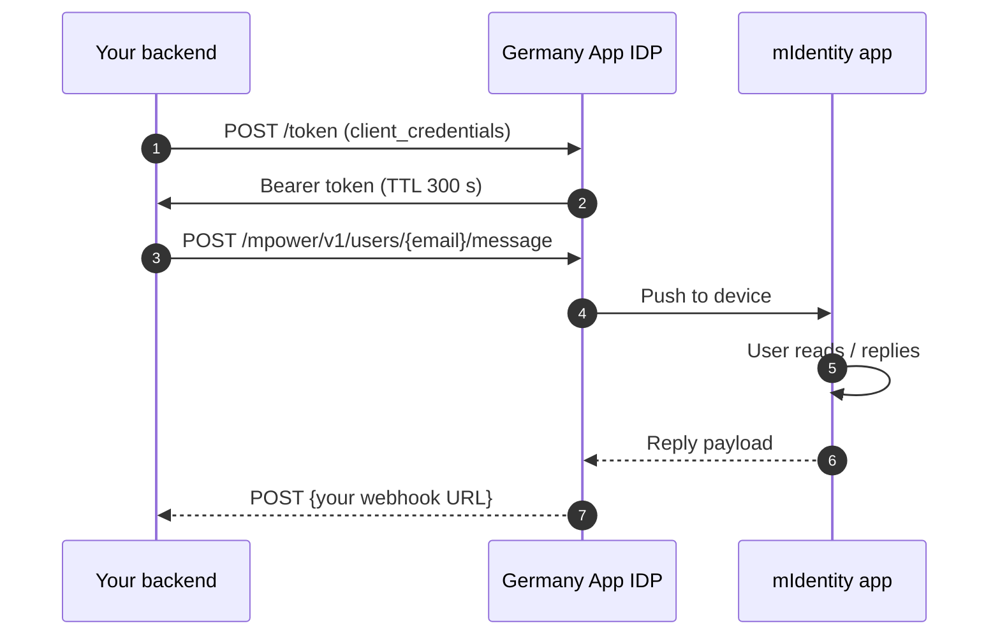

# Step 3 — Add Chat

> **Your backend posts a message; the Germany App platform delivers it to the user's mIdentity-bound device.** Replies come back to your registered webhook.

## How it flows



## 3.1 — The endpoint

```
POST {idp_host}/auth/realms/{realm}/mpower/v1/users/{userId}/message
```

- `{userId}` = **email / username** of the recipient — **not** the OIDC `sub` UUID
- Auth: `Bearer <token>` from `client_credentials` against the same realm

## 3.2 — Get a token, send a message

```bash
TOKEN=$(curl -s -X POST {idp_host}/auth/realms/{realm}/protocol/openid-connect/token \
  -u 'partner-app-server:<secret>' \
  -d 'grant_type=client_credentials' | jq -r .access_token)

curl -X POST "{idp_host}/auth/realms/{realm}/mpower/v1/users/alice@example.com/message" \
  -H "Authorization: Bearer $TOKEN" \
  -H "Content-Type: application/json" \
  -d '{
    "serviceUuid": "partner-app-server",
    "version": 3,
    "messageType": "processChatMessage",
    "messageContent": { "messageText": "Hello Alice!" }
  }'
```

Expected: HTTP 200. The user gets a push on their mIdentity device.

## 3.3 — Body schema

```json
{
  "serviceUuid": "<server client_id>",
  "version": 3,
  "messageType": "processChatMessage",
  "messageContent": {
    "messageText": "Your appointment is confirmed.",
    "choices": [{ "text": "Thanks" }, { "text": "Cancel" }]
  }
}
```

| Field | Required | Notes |
|---|---|---|
| `serviceUuid` | yes | Must equal the `client_id` of the access token. Mismatch → 401/403. |
| `version` | yes | `3` is current. |
| `messageType` | yes | `processChatMessage`, `choiceRequest`, `smartScreenService`, `attachmentMessage`. **`plainText` is rejected.** |
| `messageContent.messageText` | yes | The visible message. |
| `messageContent.choices` | no | For choice-style replies. |

## 3.4 — Receive replies (webhook)

When the user replies, the platform POSTs to your registered webhook:

```json
{
  "message": {
    "category": "chat",
    "content": {
      "messageContent": { "messageText": "..." },
      "messageType": "init",
      "version": 3
    },
    "from": { "userId": "alice@example.com", "ecoId": "<realm>" },
    "serviceUuid": "<server client_id>",
    "timestamp": "...",
    "messageId": "...",
    "responseId": "...",
    "instanceId": "..."
  }
}
```

:::warning Webhook must not require auth
The webhook URL must be **publicly reachable with no `Authorization` header expected**. If your stack puts auth in front of it by default, exempt the webhook path.
:::

## Common errors

| Status | Symptom | Cause | Fix |
|---|---|---|---|
| 404 | *User does not exist* | Sent OIDC `sub` UUID instead of email | Use email/username in the path |
| 403 | HTML body | Used `pay.*` host instead of `idp.*` | Use `idp.*` for chat |
| 401 | After idle | Token cache stale | Invalidate, retry once |
| 401 | Immediately | `serviceUuid` ≠ token `client_id` | Set `serviceUuid` to the same `client_id` |
| 400 | `messageType: "plainText"` rejected | Wrong type literal | Use `processChatMessage` |

## Next

- [Step 4 — Add Payments](/payments) (same auth, different surface)
- [Step 5 — Go Live](/go-live)

---

*Last verified: 2026-05-08.*
