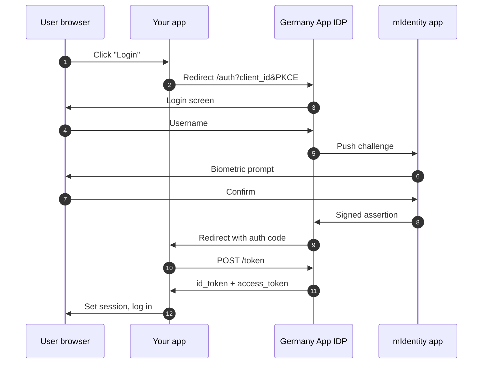

# Step 2 — Add Login

> **Standard OIDC against the Germany App identity provider, with biometric confirmation on the user's device.** Every other integration depends on this.

## How it flows



## 2.1 — The endpoints

```
{idp_host}/auth/realms/{realm}/.well-known/openid-configuration
{idp_host}/auth/realms/{realm}/protocol/openid-connect/auth
{idp_host}/auth/realms/{realm}/protocol/openid-connect/token
{idp_host}/auth/realms/{realm}/protocol/openid-connect/userinfo
{idp_host}/auth/realms/{realm}/protocol/openid-connect/logout
```

Where `{idp_host}` is from [Step 1](/get-credentials).

## 2.2 — Wire up your app

Any standard OIDC client works. With `openid-client` in Node:

```ts
import { Issuer } from "openid-client";

const issuer = await Issuer.discover(
  `${process.env.KOBIL_IDP_HOST}/auth/realms/${process.env.KOBIL_REALM}`
);
const client = new issuer.Client({
  client_id: process.env.KOBIL_USER_CLIENT_ID,
  client_secret: process.env.KOBIL_USER_CLIENT_SECRET,
  redirect_uris: [`${process.env.APP_BASE_URL}/api/auth/user/callback`],
  response_types: ["code"],
  token_endpoint_auth_method: "client_secret_post",
});
```

In the redirect: PKCE-protected authorize, callback exchanges the code for tokens, set a session cookie.

## 2.3 — Persist both `sub` and `email`

The same user has different identifiers per downstream service:

| Used in | Identifier |
|---|---|
| Your DB (canonical key) | OIDC `sub` UUID |
| Chat path `/users/{userId}/message` | **Email / username** |
| Payments body `userId` | **OIDC `sub` UUID** |

**Store both at login.** Skipping this is the single most common cause of *"User does not exist"* 404s downstream.

```ts
await db.users.upsert({
  where: { sub: claims.sub },
  create: { sub: claims.sub, email: claims.email, ... },
  update: { email: claims.email },
});
```

## 2.4 — Claims may arrive flat OR wrapped

Some attributes (phone, address, birthdate) come as top-level keys or wrapped under `attributes.{key}[0]` (Keycloak admin shape). A defensive reader:

```ts
function read(raw: Record<string, unknown>, ...names: string[]): string | undefined {
  const attrs = (raw.attributes ?? {}) as Record<string, unknown>;
  for (const name of names) {
    for (const v of [raw[name], attrs[name]]) {
      if (typeof v === "string" && v.length > 0) return v;
      if (Array.isArray(v) && typeof v[0] === "string" && v[0].length > 0) return v[0];
    }
  }
  return undefined;
}

const phone     = read(claims, "phone", "phone_number");
const birthdate = read(claims, "bod", "birthdate");
const street    = read(claims, "street", "street_address");
```

## 2.5 — Verify it works

1. Start your app, click **Login**.
2. Enter the test username.
3. Confirm the biometric prompt in the test user's mIdentity app.
4. You land back on your app with a session.
5. Check your logs: you've persisted both `sub` and `email`.

## Common errors

| Symptom | Cause | Fix |
|---|---|---|
| 400 *Invalid redirect_uri* | URL not exactly registered | Add the exact URL (with port, scheme, trailing slash) |
| 500 *displayWide* macro on auth | Custom Login Theme broken | Set Login Theme on the client to empty |
| 401 on token endpoint | Wrong secret or wrong realm | Re-copy from Credentials tab |
| Userinfo missing custom claims | Mappers not set on the client | Add mappers under Client Scopes → Mappers |

## Next

- [Step 3 — Add Chat](/chat) (server-to-user messaging)
- [Step 4 — Add Payments](/payments) (user-signed transactions)
