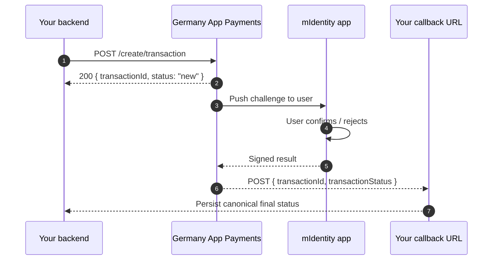

# Step 4 — Add Payments

> **Your backend creates a transaction; the user signs it with biometrics in their mIdentity app; you get the final status on your callback.** No card-network integration on your side.

## How it flows



The synchronous response is just an ack. **The real outcome arrives at your `merchantCallback`.**

## 4.1 — Hosts and paths

```
{pay_host} = https://pay.<tenant>.kobil.com
```

| Operation | Method | URL |
|---|---|---|
| Create transaction | POST | `{pay_host}/mpay-merchant/create/transaction` |
| Status query (ack only) | POST | `{pay_host}/mpay-merchant/create/transaction/status` |
| Pre-auth finalize | GET | `{pay_host}/mpay-merchant/create/transaction/postauth?id=...` |
| Cancel (void, before EOD) | POST | `{pay_host}/mpay-merchant/create/transaction/void` |
| Refund (after EOD, partial OK) | POST | `{pay_host}/mpay-merchant/create/transaction/refund` |

Auth: same `client_credentials` Bearer token as Chat. Same realm.

## 4.2 — Create-transaction body

```json
{
  "version": 1,
  "idempotencyId": "<uuid>",
  "userId": "<OIDC sub UUID>",
  "merchantId": "<server client_id>",
  "merchantServiceUUID": "<server client_id>",
  "merchantName": "Acme",
  "merchantCallback": "https://your.app/api/payment-callback",
  "transactionTimeout": 60,
  "amount": 296698,
  "tenantId": "<realm name>",
  "currency": "EUR",
  "paymentContent": [[{ "key": "Bearbeitungsgebühr", "value": "29.66 EUR" }]]
}
```

## 4.3 — Field rules that bite

| Field | Rule | Why it matters |
|---|---|---|
| `userId` | **OIDC `sub` UUID** | Different from Chat (which uses email). Sending email here fails. |
| `amount` | **Smallest currency unit (cents)** | `1999` = €19.99. |
| `transactionTimeout` | **Max 60 seconds** | `>60` returns 400 `["transactionTimeout should be maximum 60"]`. |
| `merchantId` / `merchantServiceUUID` | Both = **server client_id** | Mismatch → 401/403. |
| `merchantCallback` | **Absolute URL, publicly reachable, NO auth header** | The platform delivers status here. |
| `idempotencyId` | UUID per attempt | Re-tries with same ID won't double-charge. |
| `paymentContent` | Array of arrays of `{key, value}` | Outer = items; inner = display rows. |

## 4.4 — The callback is the source of truth

The `/status` endpoint returns ack only:

```json
{ "transactionId": "...", "status": "inquiring status", "message": "Inquire status in progress" }
```

The real outcome arrives at your `merchantCallback`:

```json
{
  "transactionId": "...",
  "operationId": null,
  "status": "finished",
  "message": "Payment complete.",
  "transactionStatus": "finished",
  "transactionMessage": "Payment complete.",
  "cardGatewayType": null,
  "nextAction": null,
  "gateway": null
}
```

Trust `transactionStatus` (or `status`) as the canonical final value.

## 4.5 — The twelve status values

| Raw | Final? | Normalize to | German label |
|---|---|---|---|
| `new` | no | `INITIATED` | Gestartet |
| `processing` | no | `PENDING` | In Bearbeitung |
| `processing_3d_secure` | no | `PENDING` | In Bearbeitung |
| `processing_digital` | no | `PENDING` | In Bearbeitung |
| `notification` | no | `PENDING` | In Bearbeitung |
| `inquiring status` (ack only) | no | `PENDING` | Status-Abfrage läuft |
| `finished` | **yes** | `SUCCESS` | Bezahlt |
| `cancelled` | **yes** | `CANCELLED` | Storniert |
| `closed` | **yes** | `CANCELLED` | Storniert |
| `timeout` | **yes** | `TIMEOUT` | Abgelaufen |
| `error` | **yes** | `FAILED` | Fehlgeschlagen |
| `void` | **yes** | `REFUNDED` | Rückerstattet |
| `refund` | **yes** | `REFUNDED` | Rückerstattet |

## 4.6 — Never overwrite a final status

:::danger Critical persistence rule
**Once you have persisted `finished`, `cancelled`, `closed`, `timeout`, `error`, `void` or `refund`, do not let a later `/status` poll overwrite it with `inquiring status` or any non-final value.**

The `/status` endpoint can return `"inquiring status"` even after the merchantCallback has already delivered SUCCESS. Naively persisting the ack will move your record from SUCCESS back to PENDING.
:::

```ts
const FINAL_STATUSES = new Set([
  "finished", "cancelled", "closed", "timeout", "error", "void", "refund",
]);

async function persistTransactionStatus(id: string, newStatus: string) {
  const current = await db.transactions.findUnique({ where: { id } });
  if (current && FINAL_STATUSES.has(current.status)) return;
  await db.transactions.update({ where: { id }, data: { status: newStatus } });
}
```

## 4.7 — TypeScript helper

```ts
// lib/germany-app-pay.ts
import { randomUUID } from "node:crypto";
import { getServerToken } from "./germany-app-token";

interface CreatePaymentInput {
  userSub: string;
  amountCents: number;
  description: string;
  callbackUrl: string;
}

export async function createPayment(input: CreatePaymentInput) {
  const token = await getServerToken();
  const url = `${process.env.KOBIL_PAY_HOST}/mpay-merchant/create/transaction`;

  const res = await fetch(url, {
    method: "POST",
    headers: {
      Authorization: `Bearer ${token}`,
      "Content-Type": "application/json",
    },
    body: JSON.stringify({
      version: 1,
      idempotencyId: randomUUID(),
      userId: input.userSub,
      merchantId: process.env.KOBIL_SERVER_CLIENT_ID,
      merchantServiceUUID: process.env.KOBIL_SERVER_CLIENT_ID,
      merchantName: "My Service",
      merchantCallback: input.callbackUrl,
      transactionTimeout: 60,
      amount: input.amountCents,
      tenantId: process.env.KOBIL_REALM,
      currency: "EUR",
      paymentContent: [[{ key: input.description, value: `${input.amountCents / 100} EUR` }]],
    }),
  });

  if (!res.ok) throw new Error(`Pay create failed: ${res.status} ${await res.text()}`);
  return res.json();
}
```

## Common errors

| Symptom | Cause | Fix |
|---|---|---|
| 400 `transactionTimeout should be maximum 60` | Sent `>60` | Cap at 60 |
| Callback received 401 by your app | Auth middleware intercepting | Whitelist callback path |
| Status forever PENDING | Callback URL relative or unreachable | Use absolute URL with explicit `APP_BASE_URL` |
| Status overwritten with UNKNOWN / `inquiring status` | Naive persistence of `/status` ack | Apply persistence rule above |
| 401 *Unauthorized* on create | Wrong `merchantId` or wrong realm | Verify `merchantId` = server client_id, `tenantId` = realm |
| 404 *user not found* | Wrong `userId` (email instead of sub) | Use OIDC `sub` UUID |

## Next

Continue to [Step 5 — Go Live](/go-live).

---

*Last verified: 2026-05-08.*
