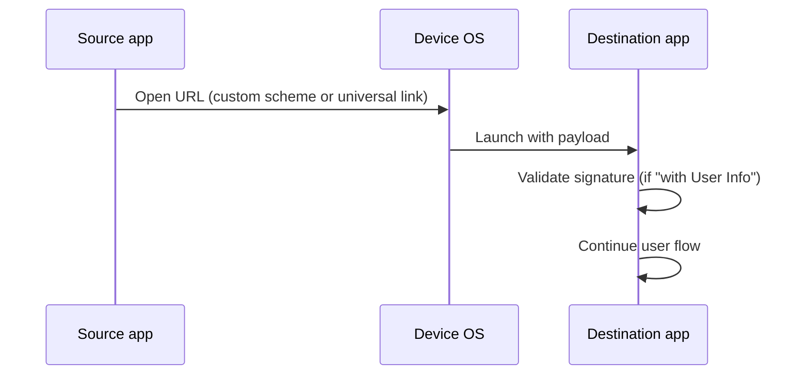

# App-to-App Services

> **Move a user from one app on their device to another, carrying context across the jump.** Either include identity (signed payload) or stay anonymous (just a deep link).

## When to use this

- A third-party app embeds a **"Pay with KOBIL"** or **"Open in MyCity"** button.
- A partner workflow finishes in your app and continues in another.
- You want to launch the KOBIL Super App container from your app while keeping a session reference.

## With user info vs without

| Variant | What's transferred | When to use |
|---|---|---|
| **App2App with User Info** *(Coming Soon)* | Signed identity claims + payload | The receiving app needs to know **who** the user is, with proof |
| **App2App without User Info** | Opaque payload (deep link parameters) | Anonymous handoff — receiving app handles auth itself |

## How it works

## Sub-pages

- **App2App with User Info** *(Coming Soon)* — signed handoff, identity claims travel with the link.
- **App2App without User Info** — anonymous deep-link handoff.

:::info This section needs detail
The App2App pages currently lack endpoint specs and signature formats. We are coordinating with the mIdentity team to publish those. Until then, contact your KOBIL Solutions Engineer for the SDK reference.
:::

## Next

- [KOBIL Identity](../core-integrations/kobil-identity) — for the OIDC primitives App2App-with-User-Info builds on.
