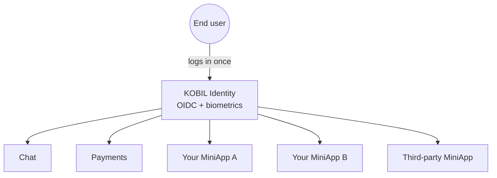

# What is a Super App?

A **Super App** is one mobile application that hosts many independent services — payments, chat, government forms, loyalty cards, ride-hailing — behind a single login. The user installs the container once; everything else lives inside it.

## What KOBIL provides

KOBIL gives you the *security and identity backbone* of a Super App:

- **Strongly-authenticated identity** — biometric, device-bound login via the mIdentity companion app.
- **Secure messaging** — server-to-user chat with delivery guarantees and replies.
- **Transaction signing** — payments and other actions confirmed by the user in mIdentity, not just clicked in a browser.
- **MiniApp hosting** — a way to drop your existing web/native UI into the container.

## What you bring

- Your **business logic** — APIs, databases, workflows.
- Your **UI** — either as a MiniApp inside the KOBIL container, or as a separate front-end that calls KOBIL services.
- Your **branding** — KOBIL is a platform. End-users see *your* Super App.

## The "one user, many services" picture

A single OIDC session unlocks every service in the container. That's the property partners are buying — you don't have to build identity, biometrics, device-binding or transaction signing yourself.

## When you do *not* need a Super App

If you only need one of the services standalone (just login, just chat, just payments), you can integrate that one service into your existing app without becoming a Super App. The integration patterns in [Core Integrations](../core-integrations/) work either way.

## Next

Continue with the [Glossary](./glossary) so the names stop overlapping in your head.
