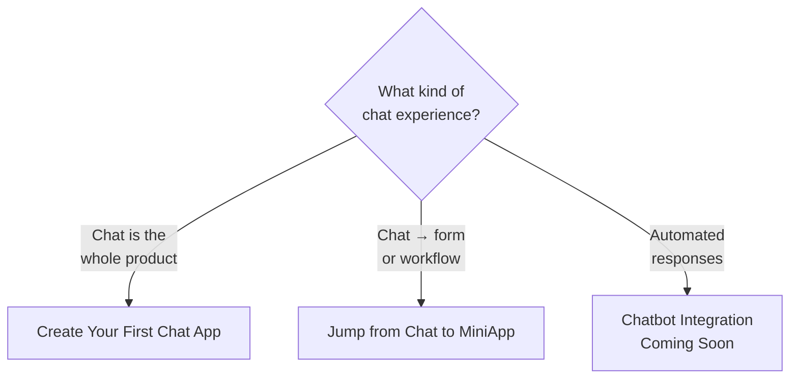

# Chat Services

> Recipes for chat-driven UX, built on top of [KOBIL Chat (mPower)](../core-integrations/kobil-chat). If you only need to send a single message from your backend, the core service is enough — this section covers the patterns that wrap around it.

## Decision tree

## Sub-pages

| Page | When you need it |
|---|---|
| **Create Your First Chat App From Scratch** | Standalone chat product — no other services in the Super App |
| **Jump from Chat to MiniApp** | A chat message opens a MiniApp when the user taps it (form, payment confirmation, document signing) |
| **Chatbot Integration** *(Coming Soon)* | Plug a bot framework into the chat surface |

## Prerequisites

All chat services share the same setup:

- Server-to-server OIDC client with **Service Accounts ON** (see [Get Your Credentials](../before-you-start/get-credentials))
- A registered webhook URL — public, no auth header
- Recipient identifier = **email/username**, not OIDC `sub` UUID

## Common gotchas across all chat patterns

- Webhook called but ignored → check that your webhook path is **whitelisted in `proxy.ts`** / auth middleware.
- Outbound message lost in serverless platforms → use `import { after } from "next/server"` so the function doesn't return before the upstream call completes. See [Production checklist](../reference/production-checklist).

## Next

- [KOBIL Chat (mPower)](../core-integrations/kobil-chat) — the underlying API.
- [Architecture diagrams](../reference/architecture-diagrams) — sequence diagrams for chat + webhook.
