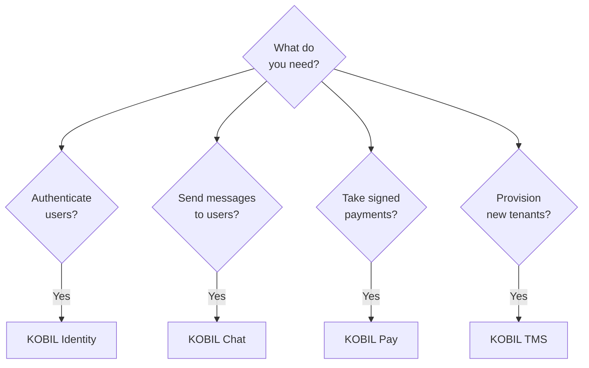

# Core Integrations

The four KOBIL services every Super App is built on.

## Decision tree — which one do you need?

Most Super Apps need **Identity + Chat + Pay**. TMS is mainly used by the KOBIL operations team and by partners that resell to multiple sub-tenants.

## The four services

| Service | What it does | Auth | Host |
|---|---|---|---|
| [**KOBIL Identity**](./kobil-identity) | OIDC login with mIdentity-bound users | OIDC discovery | `idp.<tenant>.kobil.com` |
| [**KOBIL Chat**](./kobil-chat) | Server → user messaging via mPower, with reply webhook | `client_credentials` | `idp.<tenant>.kobil.com` |
| [**KOBIL Pay**](./kobil-pay) | Merchant transactions, signed by the user in mIdentity | `client_credentials` | `pay.<tenant>.kobil.com` |
| [**KOBIL TMS**](./kobil-tms) | Tenant + realm provisioning | TMS API key | (varies — ask Solutions Engineering) |

All four share the same **multi-client OIDC pattern** (one user-facing Authorization Code + PKCE client, one server-to-server `client_credentials` client). See [Get Your Credentials](../before-you-start/get-credentials) if you haven't set those up yet.
