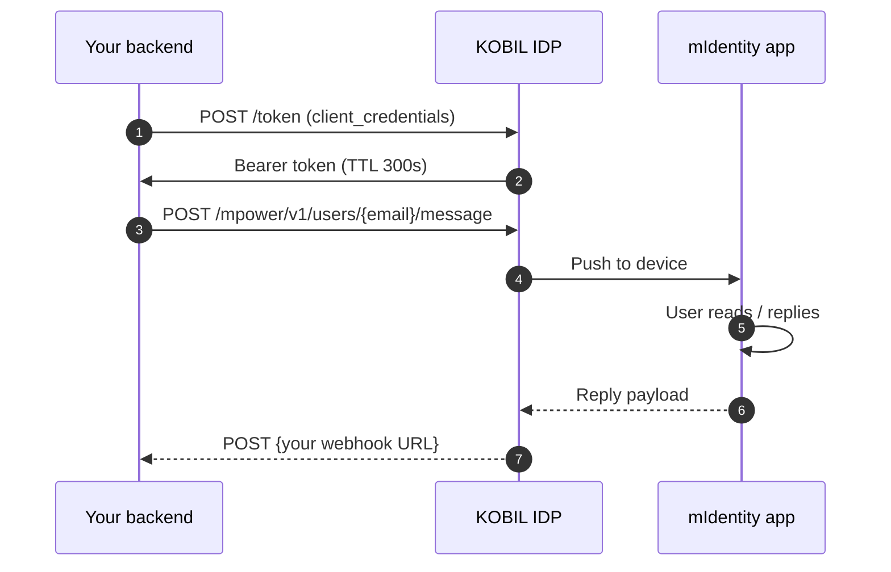

# KOBIL Chat (mPower)

> **Server-side messaging API.** Your backend posts a message; KOBIL delivers it to the user's mIdentity-bound device. Replies come back to your registered webhook.

## When to use this

- Server → user notifications and prompts (booking confirmations, action requests, choices).
- Two-way chat between back-office staff and users.
- Anywhere you'd otherwise reach for SMS — but with cryptographic delivery proof and no telco cost.

## Hosts and paths

The KOBIL chat REST surface is **mPower**, hosted on the **IDP host** (not on a separate `mercury.*` host as some older docs imply):

```
POST {idp_host}/auth/realms/{realm}/mpower/v1/users/{userId}/message
```

- `{idp_host}` = `https://idp.<tenant>.kobil.com` (e.g. `https://idp.mycity.kobil.com`)
- `{realm}` = the Keycloak realm (e.g. `buergerapp`)
- `{userId}` = **email/username** of the recipient — NOT the OIDC `sub` UUID

:::warning Legacy host
Older docs reference `mercury.<tenant>.kobil.com`. For current Cloud tenants, swap to `idp.*` if you get 404 / HTML responses.
:::

## How it works



## Authentication

Standard `client_credentials` from the same realm. The chat-app's OIDC client must have **Service Accounts Enabled = ON**.

```bash
curl -X POST {idp_host}/auth/realms/{realm}/protocol/openid-connect/token \
  -u 'your-app-server:<secret>' \
  -d 'grant_type=client_credentials'
```

Cache the token (~270 s). Invalidate on 401 and retry once.

## Request body schema

```json
{
  "serviceUuid": "<chat-app client_id>",
  "version": 3,
  "messageType": "processChatMessage",
  "messageContent": {
    "messageText": "Your appointment is confirmed.",
    "choices": [{ "text": "Thanks" }, { "text": "Cancel" }]
  }
}
```

| Field | Required | Notes |
|---|---|---|
| `serviceUuid` | yes | Must equal the `client_id` of the access token. Mismatch → 401/403. |
| `version` | yes | `3` is current. |
| `messageType` | yes | One of: `processChatMessage`, `choiceRequest`, `smartScreenService`, `attachmentMessage`. **`plainText` is rejected.** |
| `messageContent.messageText` | yes | The visible message body. |
| `messageContent.choices` | no | For `choiceRequest`-style flows. |

## Full request example

```bash
TOKEN=$(curl -s -X POST {idp_host}/auth/realms/{realm}/protocol/openid-connect/token \
  -u 'your-app-server:<secret>' \
  -d 'grant_type=client_credentials' | jq -r .access_token)

curl -X POST "{idp_host}/auth/realms/{realm}/mpower/v1/users/alice@example.com/message" \
  -H "Authorization: Bearer $TOKEN" \
  -H "Content-Type: application/json" \
  -d '{
    "serviceUuid": "your-app-server",
    "version": 3,
    "messageType": "processChatMessage",
    "messageContent": { "messageText": "Hello Alice!" }
  }'
```

Expected: HTTP 200, an empty body or a small ack JSON. The user receives a push on their mIdentity device shortly after.

## Inbound webhook payload

When the user replies (or interacts with a choice), KOBIL POSTs to your registered webhook URL:

```json
{
  "message": {
    "category": "chat",
    "content": {
      "messageContent": { "messageText": "..." },
      "messageType": "init",
      "version": 3
    },
    "from": { "userId": "alice@example.com", "ecoId": "<realm>" },
    "serviceUuid": "<chat-app client_id>",
    "timestamp": "...",
    "messageId": "...",
    "responseId": "...",
    "instanceId": "..."
  }
}
```

`messageType` for inbound messages is one of `init`, `choiceResponse`, `processChatMessage`.

:::warning Webhook auth
The webhook must be **publicly reachable with no auth header**. Whitelist its path in any `proxy.ts` / middleware. KOBIL Pay's docs explicitly say the same about its merchantCallback.
:::

## Common errors

| Status | Symptom | Cause | Fix |
|---|---|---|---|
| 404 | *User does not exist* | Sent OIDC `sub` UUID instead of email | Use email/username in the path |
| 403 | HTML body | Wrong host (used `pay.*` for chat or vice versa) | Use `idp.*` for chat |
| 401 | After idle | Token cache stale | Invalidate, retry once |
| 401 | Immediately | `serviceUuid` ≠ token `client_id` | Set `serviceUuid` to the same `client_id` |
| 400 | `messageType: "plainText"` rejected | Wrong type literal | Use `processChatMessage` |

## TypeScript helper

```ts
// lib/kobil-chat.ts
import { getServerToken } from "./kobil-token";

export async function sendChatMessage(recipientEmail: string, text: string) {
  const token = await getServerToken();
  const url = `${process.env.KOBIL_MPOWER_BASE}/users/${encodeURIComponent(recipientEmail)}/message`;

  const res = await fetch(url, {
    method: "POST",
    headers: {
      Authorization: `Bearer ${token}`,
      "Content-Type": "application/json",
    },
    body: JSON.stringify({
      serviceUuid: process.env.KOBIL_SERVER_CLIENT_ID,
      version: 3,
      messageType: "processChatMessage",
      messageContent: { messageText: text },
    }),
  });

  if (!res.ok) throw new Error(`Chat send failed: ${res.status} ${await res.text()}`);
}
```

## Reference repo

[ipyoussef-rgb/terbuch](https://github.com/ipyoussef-rgb/terbuch) — see `lib/kobil-chat.ts` and `app/api/admin/chat-webhook/route.ts`.

## Next

- [KOBIL Pay](./kobil-pay) — same auth pattern, different host and surface.
- [Chat Services](../chat-services/) — higher-level chat patterns (chat-only app, chat-to-MiniApp).

---

*Last verified: 2026-05-08 against tenant `mycity.kobil.com`.*
