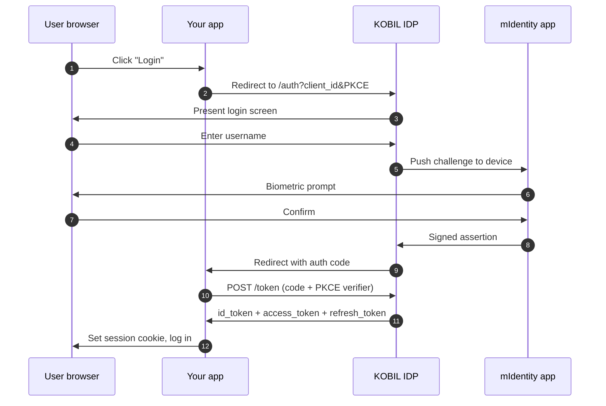

# KOBIL Identity

> **OIDC login backed by Keycloak, with the second factor handled by mIdentity on the user's device.** This is the entry point for every Super App user.

## When to use this

- Every user-facing flow in your Super App. Identity is non-optional.
- Standalone if you only need login (no chat, no payments) — the same OIDC pattern works.

## How it works



## Endpoints

KOBIL Identity is a Keycloak realm. Standard discovery applies:

```
{idp_host}/auth/realms/{realm}/.well-known/openid-configuration
{idp_host}/auth/realms/{realm}/protocol/openid-connect/auth
{idp_host}/auth/realms/{realm}/protocol/openid-connect/token
{idp_host}/auth/realms/{realm}/protocol/openid-connect/userinfo
{idp_host}/auth/realms/{realm}/protocol/openid-connect/logout
```

Where `{idp_host}` = `https://idp.<tenant>.kobil.com` and `{realm}` is the Keycloak realm name. Some tenants use the central `https://idp.cloud.kobil.com` host instead.

## Multi-client pattern

Three OIDC clients in the same realm — minimum two:

| Client | Auth flow | Settings |
|---|---|---|
| User UI | Authorization Code + PKCE (S256) | Standard Flow ON, Service Accounts OFF, Redirect URIs set |
| Admin UI (optional) | Authorization Code + PKCE (S256) | Same as User UI, different redirect URI |
| Server-to-server | `client_credentials` | Service Accounts ON, Standard Flow OFF |

Same `idp_issuer` and `realm` for all. Different `client_id`/`client_secret` per client.

See [Get Your Credentials](../before-you-start/get-credentials) for the click-by-click setup.

## Service-to-service token

```bash
curl -X POST {idp_host}/auth/realms/{realm}/protocol/openid-connect/token \
  -u 'your-app-server:<server-client-secret>' \
  -d 'grant_type=client_credentials'
```

Response:

```json
{ "access_token": "eyJ...", "expires_in": 300, "token_type": "Bearer" }
```

**Cache the token in memory for ~270 s** (Keycloak default TTL is 300 s). On a 401, invalidate and retry once with a fresh token.

## Claims mapping — the flat-attribute shape

Standard OIDC userinfo nests address claims under `address.{...}`. **KOBIL tenants commonly emit them flat OR wrapped under `attributes.{key}[0]`** (Keycloak admin shape):

```jsonc
// Flat
{ "phone": "00492555658", "street": "Pforten 11", "locality": "Worms", "postal_code": "67547", "bod": "1990-01-15" }

// Or wrapped
{ "attributes": { "phone": ["00492555658"], "street": ["Pforten 11"], "bod": ["1990-01-15"] } }
```

A defensive read helper that handles both:

```ts
function read(raw: Record<string, unknown>, ...names: string[]): string | undefined {
  const attrs = (raw.attributes ?? {}) as Record<string, unknown>;
  for (const name of names) {
    for (const v of [raw[name], attrs[name]]) {
      if (typeof v === "string" && v.length > 0) return v;
      if (Array.isArray(v) && typeof v[0] === "string" && v[0].length > 0) return v[0];
    }
  }
  return undefined;
}

const phone     = read(claims, "phone", "phone_number", "phoneNumber");
const birthdate = read(claims, "bod", "birthdate", "birthDate");
const street    = read(claims, "street", "street_address");
const postal    = read(claims, "postal_code", "postalCode");
const city      = read(claims, "locality", "city");
```

## Recipient-ID rule

The same user has **different identifiers per downstream service**:

| Service | Identifier |
|---|---|
| Your DB (canonical key) | OIDC `sub` UUID |
| **mPower chat** path `/users/{userId}/message` | **Email / username** |
| **mPay** body `userId` | **OIDC `sub` UUID** |

**Store both `sub` and `email` at login time.** Skipping this is the single most common cause of *"User does not exist"* 404s downstream.

## Redirect URIs

Keycloak validates **Valid Redirect URIs exactly**. Common 400 *Invalid redirect_uri* causes:

- Trailing slash difference (`/callback` vs `/callback/`)
- Vercel preview URL ≠ registered prod URL — set `APP_BASE_URL` to the canonical production URL
- Missing `localhost` entry in dev

Register both production and dev:

```
https://your.app/api/auth/{user|admin}/callback
http://localhost:3000/api/auth/{user|admin}/callback
```

## Common errors

| Symptom | Cause | Fix |
|---|---|---|
| 400 *Invalid redirect_uri* | URL not exactly registered | Add the exact URL to Valid Redirect URIs |
| 500 with `displayWide` macro error on auth endpoint | Custom Login Theme broken | Set Login Theme on the client to empty (= realm default) |
| 401 on token endpoint | Wrong `client_id`/`client_secret` or wrong realm | Verify against Credentials tab |
| `client_credentials` returns 400 *unauthorized_client* | Service Accounts not enabled | Toggle Service Accounts ON |
| Userinfo missing custom claims | Mappers not set on the client | Add mappers under Client Scopes → Mappers |

## Reference repo

End-to-end implementation in Next.js + `openid-client` v6: [ipyoussef-rgb/terbuch](https://github.com/ipyoussef-rgb/terbuch).

## Next

- [KOBIL Chat](./kobil-chat) — server-to-user messaging using the same realm.
- [KOBIL Pay](./kobil-pay) — merchant transactions using the same realm.

---

*Last verified: 2026-05-08.*
