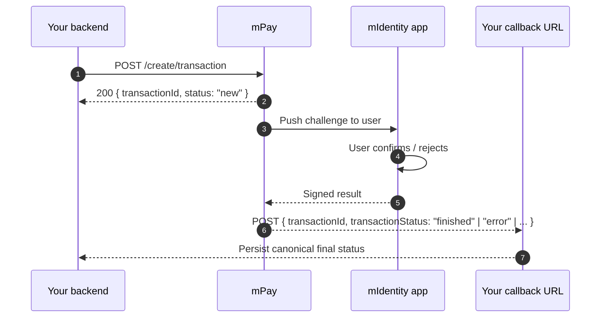

# KOBIL Pay (mPay)

> **Merchant API for transactions signed by the user in their mIdentity app.** Strong customer authentication out of the box; no card-network integration on your side.

## When to use this

- Any payment that needs strong user confirmation.
- Any "sign this action" flow — payments are the most common, but the same surface signs other transactions.
- When you want a delivery proof that the *user* (not just the device) approved the transaction.

## Hosts and paths

```
{pay_host}     = https://pay.<tenant>.kobil.com
{idp_host}     = https://idp.<tenant>.kobil.com    (only for tokens)
{realm}        = Keycloak realm name               (e.g. buergerapp)
```

| Operation | Method | URL |
|---|---|---|
| Create transaction | POST | `{pay_host}/mpay-merchant/create/transaction` |
| Status query (ack only) | POST | `{pay_host}/mpay-merchant/create/transaction/status` |
| Pre-auth finalize | GET | `{pay_host}/mpay-merchant/create/transaction/postauth?id=...` |
| Cancel (void, before EOD) | POST | `{pay_host}/mpay-merchant/create/transaction/void` |
| Refund (after EOD, partial OK) | POST | `{pay_host}/mpay-merchant/create/transaction/refund` |

## Authentication

Same `client_credentials` Bearer-token pattern as [KOBIL Chat](./kobil-chat). Same realm. Same token-cache rules.

## How a payment flows



The synchronous response is just an ack. **The real outcome arrives at your `merchantCallback`** later — sometimes seconds, sometimes minutes.

## Create-transaction body

```json
{
  "version": 1,
  "idempotencyId": "<uuid>",
  "userId": "<KOBIL user UUID = OIDC sub>",
  "merchantId": "<Pay client_id>",
  "merchantServiceUUID": "<Pay client_id>",
  "merchantName": "Acme",
  "merchantCallback": "https://your.app/api/payment-callback",
  "transactionTimeout": 60,
  "amount": 296698,
  "tenantId": "<realm name>",
  "currency": "EUR",
  "paymentContent": [[{ "key": "Bearbeitungsgebühr", "value": "29.66 EUR" }]]
}
```

## Field rules that bite

| Field | Rule | Why it matters |
|---|---|---|
| `userId` | **OIDC `sub` UUID** | Different from chat (which uses email). Sending email here fails. |
| `amount` | **Smallest currency unit (cents)** | `1999` = €19.99. |
| `transactionTimeout` | **Max 60 seconds** | `>60` returns 400 `["transactionTimeout should be maximum 60"]`. |
| `merchantId` / `merchantServiceUUID` | Both equal the **Pay client_id** | Mismatch → 401/403. |
| `merchantCallback` | **Absolute URL, publicly reachable, NO auth** | KOBIL docs explicitly say *"Shouldn't ask for Authorization."* |
| `idempotencyId` | UUID per attempt | Re-tries with the same ID won't double-charge. |
| `paymentContent` | Array of arrays of `{key, value}` | Outer array = items; inner array = display rows. |

## merchantCallback is the source of truth

> Per the docs: "all results of these operations will be delivered to you via your merchantCallback API address. We notify you of all changes of transaction status via API call."

The `/status` endpoint returns ack only:

```json
{ "transactionId": "...", "status": "inquiring status", "message": "Inquire status in progress" }
```

The real outcome arrives at your `merchantCallback`:

```json
{
  "transactionId": "...",
  "operationId": null,
  "status": "finished",
  "message": "Payment complete.",
  "transactionStatus": "finished",
  "transactionMessage": "Payment complete.",
  "cardGatewayType": null,
  "nextAction": null,
  "gateway": null
}
```

Trust `transactionStatus` (or `status`) as the canonical final value.

## The twelve status values

| Raw | Final? | Normalize to | German label |
|---|---|---|---|
| `new` | no | `INITIATED` | Gestartet |
| `processing` | no | `PENDING` | In Bearbeitung |
| `processing_3d_secure` | no | `PENDING` | In Bearbeitung |
| `processing_digital` | no | `PENDING` | In Bearbeitung |
| `notification` | no | `PENDING` | In Bearbeitung |
| `inquiring status` (ack only) | no | `PENDING` | Status-Abfrage läuft |
| `finished` | **yes** | `SUCCESS` | Bezahlt |
| `cancelled` | **yes** | `CANCELLED` | Storniert |
| `closed` | **yes** | `CANCELLED` | Storniert |
| `timeout` | **yes** | `TIMEOUT` | Abgelaufen |
| `error` | **yes** | `FAILED` | Fehlgeschlagen |
| `void` | **yes** | `REFUNDED` | Rückerstattet |
| `refund` | **yes** | `REFUNDED` | Rückerstattet |

## Status-persistence rule

:::danger Never overwrite a final status
**Once you have persisted `finished`, `cancelled`, `closed`, `timeout`, `error`, `void` or `refund`, do not let a later `/status` poll overwrite it with `inquiring status` or any non-final value.**

The `/status` endpoint can return `"inquiring status"` even after the merchantCallback has already delivered SUCCESS. Naively persisting the ack will move your record from SUCCESS back to PENDING / UNKNOWN. The merchantCallback is the source of truth.
:::

Implementation pattern:

```ts
const FINAL_STATUSES = new Set([
  "finished", "cancelled", "closed", "timeout", "error", "void", "refund",
]);

async function persistTransactionStatus(id: string, newStatus: string) {
  const current = await db.transactions.findUnique({ where: { id } });
  if (current && FINAL_STATUSES.has(current.status)) {
    return;
  }
  await db.transactions.update({ where: { id }, data: { status: newStatus } });
}
```

## Common errors

| Symptom | Cause | Fix |
|---|---|---|
| 400 `transactionTimeout should be maximum 60` | Sent `>60` | Cap at 60 |
| Pay callback received 401 by your app | Auth middleware intercepting | Whitelist callback path in `proxy.ts` |
| Status forever PENDING | Callback URL relative or unreachable | Use absolute URL with explicit `APP_BASE_URL` |
| Status overwritten with UNKNOWN / `inquiring status` | Naive persistence of `/status` ack | Apply persistence rule above |
| 401 *Unauthorized* on create | Wrong `merchantId` / wrong realm | Verify `merchantId` = Pay client_id, `tenantId` = realm |
| 404 *user not found* | Wrong `userId` (email instead of sub) | Use OIDC `sub` UUID |

## TypeScript helper

```ts
// lib/kobil-pay.ts
import { randomUUID } from "node:crypto";
import { getServerToken } from "./kobil-token";

interface CreatePaymentInput {
  userSub: string;
  amountCents: number;
  description: string;
  callbackUrl: string;
}

export async function createPayment(input: CreatePaymentInput) {
  const token = await getServerToken();
  const url = `${process.env.KOBIL_PAY_BASE}/mpay-merchant/create/transaction`;

  const res = await fetch(url, {
    method: "POST",
    headers: {
      Authorization: `Bearer ${token}`,
      "Content-Type": "application/json",
    },
    body: JSON.stringify({
      version: 1,
      idempotencyId: randomUUID(),
      userId: input.userSub,
      merchantId: process.env.KOBIL_SERVER_CLIENT_ID,
      merchantServiceUUID: process.env.KOBIL_SERVER_CLIENT_ID,
      merchantName: "My Super App",
      merchantCallback: input.callbackUrl,
      transactionTimeout: 60,
      amount: input.amountCents,
      tenantId: process.env.KOBIL_REALM,
      currency: "EUR",
      paymentContent: [[{ key: input.description, value: `${input.amountCents / 100} EUR` }]],
    }),
  });

  if (!res.ok) throw new Error(`Pay create failed: ${res.status} ${await res.text()}`);
  return res.json();
}
```

## Reference repo

[ipyoussef-rgb/terbuch](https://github.com/ipyoussef-rgb/terbuch) — see `lib/kobil-pay.ts`, `app/api/payment-callback/route.ts`, and `lib/payment-status.ts`.

## Next

- [Production checklist](../reference/production-checklist) — what to verify before go-live.
- [Error codes & troubleshooting](../reference/error-codes) — full list across all services.

---

*Last verified: 2026-05-08 against tenant `mycity.kobil.com`.*
