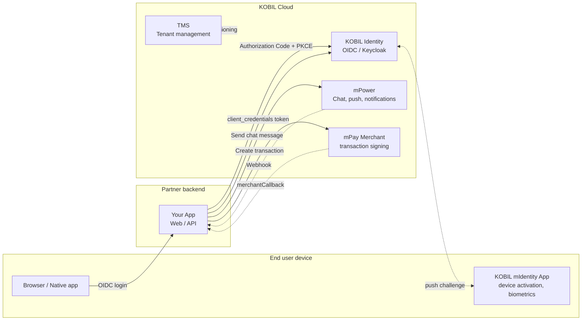

# Super App Services

> **A Super App is one mobile container that hosts independent MiniApps, secure chat, payments and identity behind one strongly-authenticated user.**
> KOBIL provides the platform; you bring your services. This guide takes a partner developer from zero credentials to a production integration.

:::info Who is this for?
This documentation is written for **backend and full-stack developers at a KOBIL partner** who are integrating one or more KOBIL services into their own application or Super App. If you are evaluating KOBIL commercially, start at [kobil.com](https://kobil.com) instead.
:::

## Architecture at a glance

## Start here

A linear path from nothing to a working integration. Skip steps you've already done.

| # | Step | Time | What you get |
|---|------|------|--------------|
| 1 | [Before You Start](./before-you-start/) | 10 min | The vocabulary, the prerequisites and the credentials you need from us |
| 2 | [Quickstart: Hello SuperApp](./quickstart) | 60 min | A running Next.js app with login, one chat message and one payment |
| 3 | [Pick your services](#pick-your-services) | varies | Deep-dive into the services you actually need |
| 4 | [Production checklist](./reference/production-checklist) | 30 min | Hardening, observability, rate limits, callback security |

## Pick your services

Once the Quickstart works, drill into the services your product needs.

### [Core Integrations](./core-integrations/)

The four building blocks every Super App is made of.

- **[KOBIL Identity](./core-integrations/kobil-identity)** — OIDC login, single sign-on, claims, the multi-client pattern.
- **[KOBIL Chat](./core-integrations/kobil-chat)** — server-to-user messaging via the mPower API, with webhook for replies.
- **[KOBIL Pay](./core-integrations/kobil-pay)** — merchant transactions on mPay, signed by the user in mIdentity.
- **[KOBIL TMS](./core-integrations/kobil-tms)** — tenant provisioning and realm management.

### [MiniApp Services](./miniapp-services/)

Embed your own UI inside the Super App container — manifest, lifecycle, distribution.

### [Chat Services](./chat-services/)

Higher-level chat patterns: a chat-only app, chat-to-MiniApp jumps, and (soon) chatbot integration.

### [App-to-App Services](./app-to-app/)

Hand off context between two apps on the same device — with or without identifying the user.

## Reference

- [Architecture diagrams](./reference/architecture-diagrams) — copy-paste-ready Mermaid sequences for every flow.
- [Error codes & troubleshooting](./reference/error-codes) — the 401/403/404 you'll hit, and the fix.
- [Production checklist](./reference/production-checklist) — what to verify before go-live.

---

*Last verified: 2026-05-08 against tenant `mycity.kobil.com`.*
