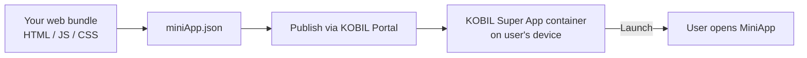

# MiniApp Services

> **A MiniApp is your application running inside the KOBIL Super App container.** The user already has the container installed and is already authenticated; your MiniApp inherits both.

## When to use a MiniApp

- You want to **distribute through the KOBIL Super App** — no separate App Store presence needed.
- You want to **inherit the user's session** — no second login.
- You want **strong actions to be signed via mIdentity** without building that yourself.

## When *not* to use a MiniApp

- You only need server-side integration (no UI inside KOBIL) — call [Core Integrations](../core-integrations/) directly instead.
- You need offline-first native capabilities the MiniApp surface doesn't expose.

## How a MiniApp ships

## Sub-pages

- **Build Your First MiniApp** — clone the sample, edit, run locally inside the dev container.
- **Publish & Distribute** — upload the bundle, set the manifest, push to staging then production.

:::info This section needs detail
The MiniApp sub-pages are stubs awaiting input from the MiniApp team. The miniApp.json schema is currently generated by the [miniApp.json Generator](https://documentation.cloud.kobil.com/) tool — we'll publish the field reference here.
:::

## Tooling

- [**miniApp.json Generator**](https://documentation.cloud.kobil.com/) — interactive form that produces a valid manifest.
- [**Sample MiniApps**](https://documentation.cloud.kobil.com/) — reference projects you can fork.
- **KOBIL AI Assistant** — chat-based help from inside the docs site.

## Next

- [Core Integrations](../core-integrations/) — the services your MiniApp will call.
- [Chat Services](../chat-services/) — including the **Jump from Chat to MiniApp** pattern, where a chat message launches a MiniApp on tap.
