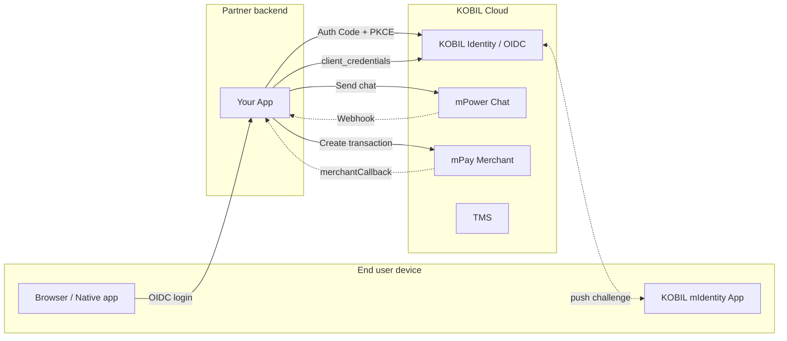
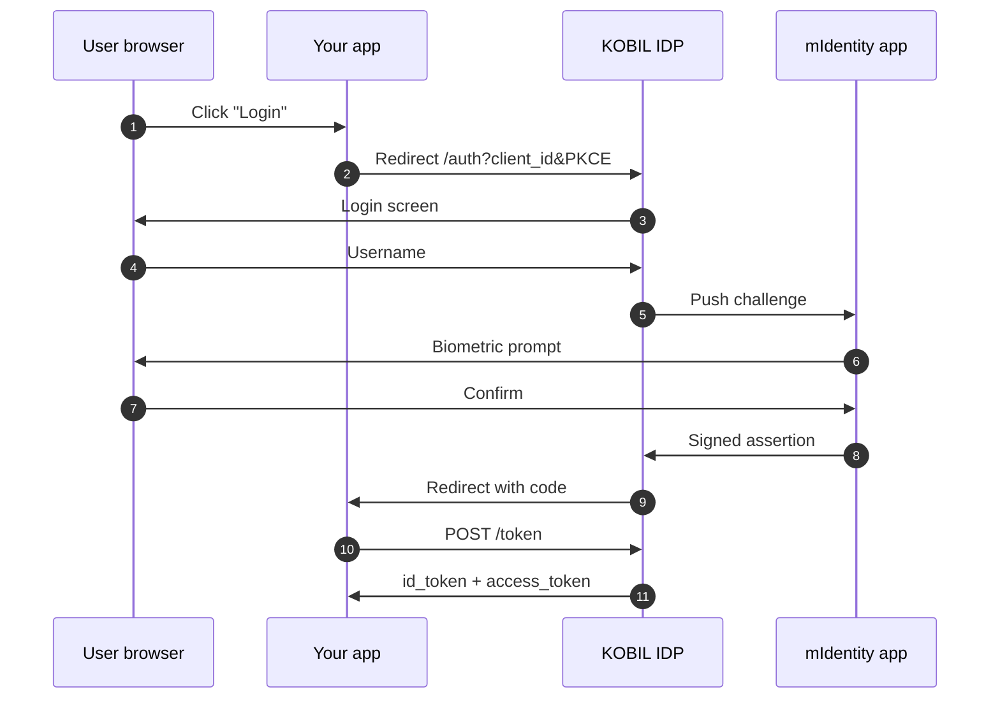
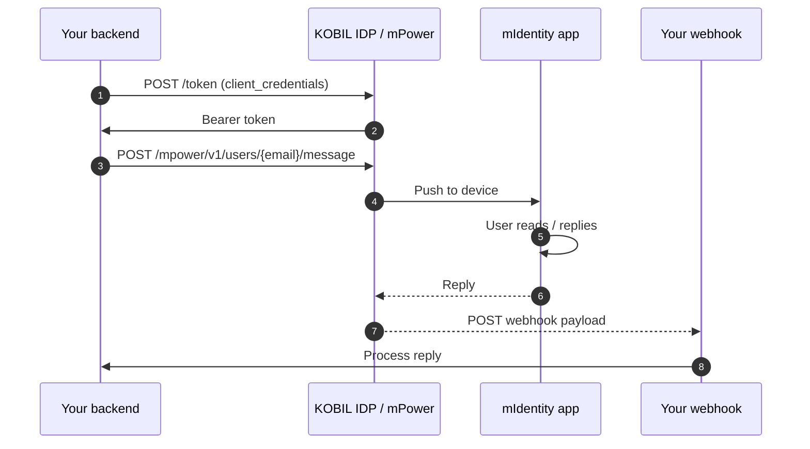
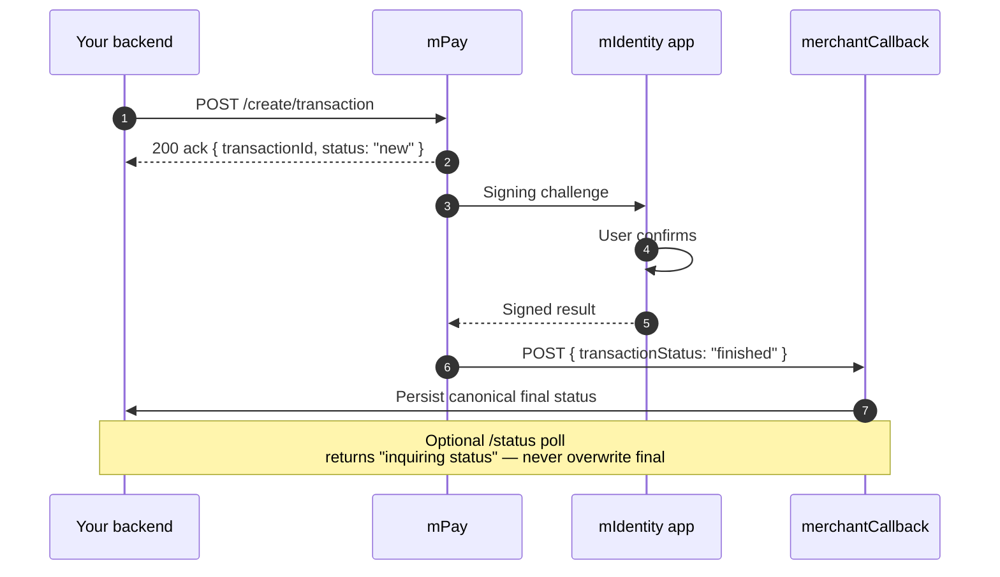
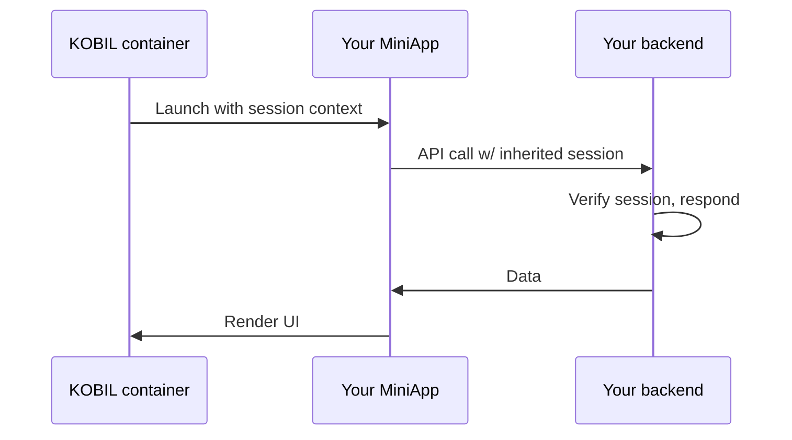

# Architecture Diagrams

All diagrams use Mermaid and render natively in Docusaurus. Copy them into your own design docs.

## Platform overview

## OIDC login

## Chat: send + reply

## Pay: create + sign + callback

## MiniApp launch

