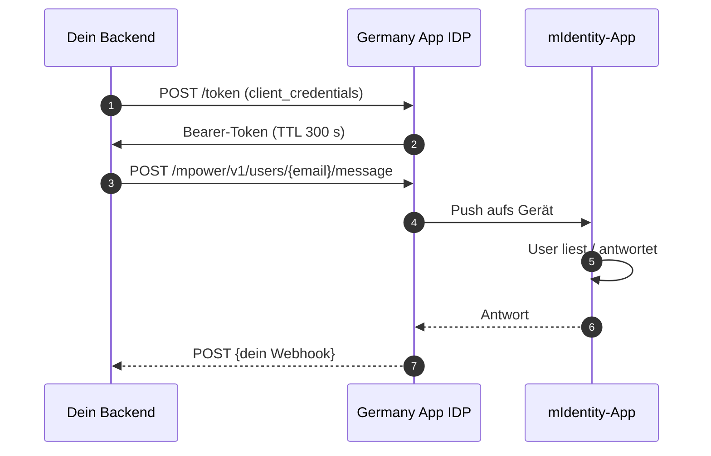

# Schritt 3 — Chat einbauen

> **Dein Backend postet eine Nachricht; die Germany-App-Plattform stellt sie auf dem mIdentity-gebundenen Gerät des Users zu.** Antworten kommen an deinen registrierten Webhook zurück.

## Wie es fließt



## 3.1 — Der Endpoint

```
POST {idp_host}/auth/realms/{realm}/mpower/v1/users/{userId}/message
```

- `{userId}` = **E-Mail / Username** des Empfängers — **nicht** die OIDC-`sub` UUID
- Auth: `Bearer <token>` aus `client_credentials` im selben Realm

## 3.2 — Token holen, Nachricht senden

```bash
TOKEN=$(curl -s -X POST {idp_host}/auth/realms/{realm}/protocol/openid-connect/token \
  -u 'partner-app-server:<secret>' \
  -d 'grant_type=client_credentials' | jq -r .access_token)

curl -X POST "{idp_host}/auth/realms/{realm}/mpower/v1/users/alice@example.com/message" \
  -H "Authorization: Bearer $TOKEN" \
  -H "Content-Type: application/json" \
  -d '{
    "serviceUuid": "partner-app-server",
    "version": 3,
    "messageType": "processChatMessage",
    "messageContent": { "messageText": "Hallo Alice!" }
  }'
```

Erwartet: HTTP 200. Alice bekommt einen Push auf ihrer mIdentity-App.

## 3.3 — Body-Schema

```json
{
  "serviceUuid": "<server client_id>",
  "version": 3,
  "messageType": "processChatMessage",
  "messageContent": {
    "messageText": "Dein Termin ist bestätigt.",
    "choices": [{ "text": "Danke" }, { "text": "Stornieren" }]
  }
}
```

| Feld | Pflicht | Hinweis |
|---|---|---|
| `serviceUuid` | ja | Muss gleich der `client_id` des Tokens sein. Mismatch → 401/403. |
| `version` | ja | `3` ist aktuell. |
| `messageType` | ja | `processChatMessage`, `choiceRequest`, `smartScreenService`, `attachmentMessage`. **`plainText` wird abgelehnt.** |
| `messageContent.messageText` | ja | Der sichtbare Text. |
| `messageContent.choices` | nein | Für Auswahl-Antworten. |

## 3.4 — Antworten empfangen (Webhook)

Wenn der User antwortet, POSTet die Plattform an deinen registrierten Webhook:

```json
{
  "message": {
    "category": "chat",
    "content": {
      "messageContent": { "messageText": "..." },
      "messageType": "init",
      "version": 3
    },
    "from": { "userId": "alice@example.com", "ecoId": "<realm>" },
    "serviceUuid": "<server client_id>",
    "timestamp": "...",
    "messageId": "...",
    "responseId": "...",
    "instanceId": "..."
  }
}
```

:::warning Webhook ohne Auth-Header
Der Webhook muss **öffentlich erreichbar ohne `Authorization`-Header** sein. Wenn dein Stack standardmäßig Auth davor hängt, den Webhook-Pfad davon ausnehmen.
:::

## Häufige Fehler

| Status | Symptom | Ursache | Fix |
|---|---|---|---|
| 404 | *User does not exist* | OIDC-`sub` statt E-Mail geschickt | E-Mail / Username im Pfad |
| 403 | HTML-Body | Falscher Host (`pay.*` statt `idp.*`) | `idp.*` für Chat |
| 401 | Nach Idle | Token-Cache veraltet | Invalidieren, einmal retry |
| 401 | Sofort | `serviceUuid` ≠ Token-`client_id` | Gleichsetzen |
| 400 | `messageType: "plainText"` abgelehnt | Falsches Literal | `processChatMessage` benutzen |

## Weiter

- [Schritt 4 — Payments einbauen](/payments)
- [Schritt 5 — Go Live](/go-live)

---

*Zuletzt verifiziert: 08.05.2026.*
