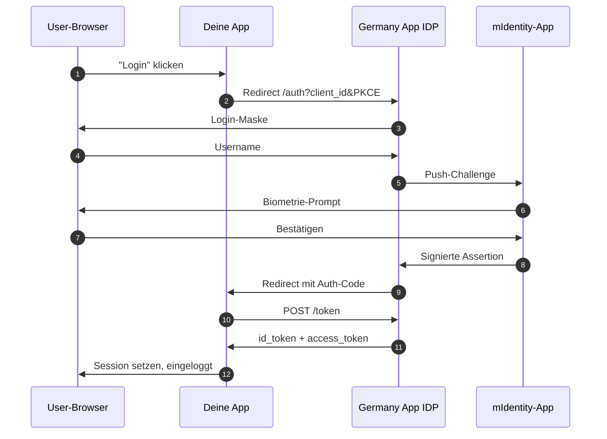

# Schritt 2 — Login einbauen

> **Standard-OIDC gegen den Germany-App-IDP, mit biometrischer Bestätigung auf dem Gerät des Users.** Jede andere Integration baut darauf auf.

## Wie es fließt



## 2.1 — Die Endpoints

```
{idp_host}/auth/realms/{realm}/.well-known/openid-configuration
{idp_host}/auth/realms/{realm}/protocol/openid-connect/auth
{idp_host}/auth/realms/{realm}/protocol/openid-connect/token
{idp_host}/auth/realms/{realm}/protocol/openid-connect/userinfo
{idp_host}/auth/realms/{realm}/protocol/openid-connect/logout
```

`{idp_host}` kommt aus [Schritt 1](/get-credentials).

## 2.2 — Die drei Calls, die deine App macht

Der Flow ist Standard-OIDC Authorization Code + PKCE. Nimm irgendeine OIDC-Library in irgendeiner Sprache oder ruf die Endpoints direkt auf.

**a. Den User zur Authorize-URL umleiten**

```
GET {idp_host}/auth/realms/{realm}/protocol/openid-connect/auth
    ?client_id={user-client-id}
    &redirect_uri={dein-callback}
    &response_type=code
    &scope=openid+profile+email
    &state={zufallswert}
    &code_challenge={pkce-challenge}
    &code_challenge_method=S256
```

**b. Den Callback empfangen**

Der IDP leitet den User zurück auf deine `redirect_uri` mit `?code=...&state=...`.

**c. Code gegen Tokens tauschen**

```bash
curl -X POST {idp_host}/auth/realms/{realm}/protocol/openid-connect/token \
  -d 'grant_type=authorization_code' \
  -d 'code={code-aus-callback}' \
  -d 'redirect_uri={dein-callback}' \
  -d 'client_id={user-client-id}' \
  -d 'client_secret={user-client-secret}' \
  -d 'code_verifier={pkce-verifier}'
```

Antwort:

```json
{
  "access_token": "eyJ...",
  "id_token": "eyJ...",
  "refresh_token": "eyJ...",
  "expires_in": 300,
  "token_type": "Bearer"
}
```

`id_token` dekodieren für die Claims (oder `/userinfo` mit dem Access-Token aufrufen). Deine eigene Session daraus aufbauen.

## 2.3 — `sub` UND `email` speichern

Derselbe User hat **unterschiedliche Identifier pro Service**:

| Verwendet in | Identifier |
|---|---|
| Deine DB (kanonischer Key) | OIDC `sub` UUID |
| Chat-Pfad `/users/{userId}/message` | **E-Mail / Username** |
| Payments-Body `userId` | **OIDC `sub` UUID** |

**Beide beim Login speichern.** Das ist die Nr.-1-Ursache für *"User does not exist"*-404er weiter unten.

```ts
await db.users.upsert({
  where: { sub: claims.sub },
  create: { sub: claims.sub, email: claims.email, ... },
  update: { email: claims.email },
});
```

## 2.4 — Claims kommen flach ODER verschachtelt

Manche Attribute (Telefon, Adresse, Geburtsdatum) kommen als Top-Level-Keys oder verschachtelt unter `attributes.{key}[0]`. Defensiver Reader:

```ts
function read(raw: Record<string, unknown>, ...names: string[]): string | undefined {
  const attrs = (raw.attributes ?? {}) as Record<string, unknown>;
  for (const name of names) {
    for (const v of [raw[name], attrs[name]]) {
      if (typeof v === "string" && v.length > 0) return v;
      if (Array.isArray(v) && typeof v[0] === "string" && v[0].length > 0) return v[0];
    }
  }
  return undefined;
}

const phone     = read(claims, "phone", "phone_number");
const birthdate = read(claims, "bod", "birthdate");
const street    = read(claims, "street", "street_address");
```

## 2.5 — Verifizieren

1. App starten, **Login** klicken.
2. Test-Username eingeben.
3. Biometrie-Prompt in der mIdentity-App des Test-Users bestätigen.
4. Du landest mit Session zurück in der App.
5. Logs prüfen: `sub` UND `email` gespeichert.

## Häufige Fehler

| Symptom | Ursache | Fix |
|---|---|---|
| 400 *Invalid redirect_uri* | URL nicht exakt registriert | Exakte URL eintragen (Port, Schema, Slash) |
| 500 *displayWide*-Macro | Login Theme kaputt | Theme auf leer setzen |
| 401 am Token-Endpoint | Falsches Secret oder Realm | Secret neu kopieren |
| Userinfo ohne Custom-Claims | Mapper nicht gesetzt | Client Scopes → Mappers ergänzen |

## Weiter

- [Schritt 3 — Chat einbauen](/chat)
- [Schritt 4 — Payments einbauen](/payments)
