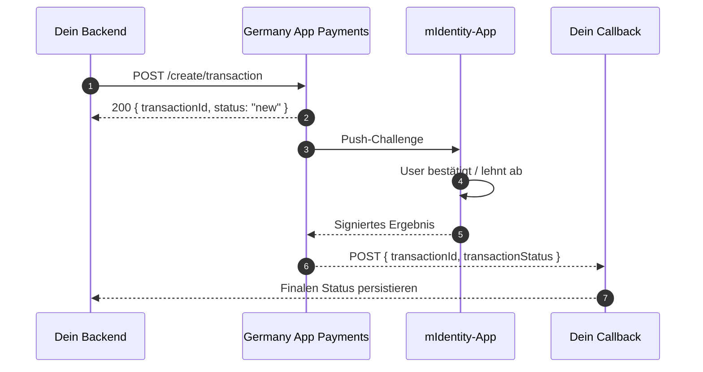

# Schritt 4 — Payments einbauen

> **Dein Backend erstellt eine Transaktion; der User signiert sie biometrisch in der mIdentity-App; den finalen Status bekommst du auf deinen Callback.** Kein Card-Network-Aufwand auf deiner Seite.

## Wie es fließt



Die synchrone Antwort ist nur ein Ack. **Das eigentliche Ergebnis kommt am `merchantCallback`.**

## 4.1 — Hosts und Pfade

```
{pay_host} = https://pay.<tenant>.kobil.com
```

| Operation | Methode | URL |
|---|---|---|
| Transaktion erstellen | POST | `{pay_host}/mpay-merchant/create/transaction` |
| Status-Abfrage (nur Ack) | POST | `{pay_host}/mpay-merchant/create/transaction/status` |
| Pre-Auth abschließen | GET | `{pay_host}/mpay-merchant/create/transaction/postauth?id=...` |
| Stornieren (vor EOD) | POST | `{pay_host}/mpay-merchant/create/transaction/void` |
| Rückerstatten (nach EOD, teilweise OK) | POST | `{pay_host}/mpay-merchant/create/transaction/refund` |

Auth: dasselbe `client_credentials`-Bearer-Token wie bei Chat. Gleicher Realm.

## 4.2 — Create-Transaction-Body

```json
{
  "version": 1,
  "idempotencyId": "<uuid>",
  "userId": "<OIDC sub UUID>",
  "merchantId": "<server client_id>",
  "merchantServiceUUID": "<server client_id>",
  "merchantName": "Acme",
  "merchantCallback": "https://your.app/api/payment-callback",
  "transactionTimeout": 60,
  "amount": 296698,
  "tenantId": "<realm name>",
  "currency": "EUR",
  "paymentContent": [[{ "key": "Bearbeitungsgebühr", "value": "29.66 EUR" }]]
}
```

## 4.3 — Feldregeln, die beißen

| Feld | Regel | Warum es wichtig ist |
|---|---|---|
| `userId` | **OIDC-`sub` UUID** | Anders als Chat (E-Mail). E-Mail hier schlägt fehl. |
| `amount` | **Kleinste Währungseinheit (Cents)** | `1999` = 19,99 €. |
| `transactionTimeout` | **Max. 60 Sekunden** | `>60` → 400 `["transactionTimeout should be maximum 60"]`. |
| `merchantId` / `merchantServiceUUID` | Beide = **server client_id** | Mismatch → 401/403. |
| `merchantCallback` | **Absolute URL, öffentlich, OHNE Auth-Header** | Plattform liefert Status hier ab. |
| `idempotencyId` | UUID pro Versuch | Re-Tries mit gleicher ID buchen nicht doppelt. |
| `paymentContent` | Array von Arrays mit `{key, value}` | Außen = Items; innen = Anzeigezeilen. |

## 4.4 — Der Callback ist die Wahrheit

Der `/status`-Endpoint gibt nur Ack zurück:

```json
{ "transactionId": "...", "status": "inquiring status", "message": "Inquire status in progress" }
```

Das echte Ergebnis kommt am `merchantCallback`:

```json
{
  "transactionId": "...",
  "operationId": null,
  "status": "finished",
  "message": "Payment complete.",
  "transactionStatus": "finished",
  "transactionMessage": "Payment complete.",
  "cardGatewayType": null,
  "nextAction": null,
  "gateway": null
}
```

`transactionStatus` (oder `status`) ist der finale Wert.

## 4.5 — Die zwölf Status-Werte

| Roh | Final? | Normiere auf | DE-Label |
|---|---|---|---|
| `new` | nein | `INITIATED` | Gestartet |
| `processing` | nein | `PENDING` | In Bearbeitung |
| `processing_3d_secure` | nein | `PENDING` | In Bearbeitung |
| `processing_digital` | nein | `PENDING` | In Bearbeitung |
| `notification` | nein | `PENDING` | In Bearbeitung |
| `inquiring status` (nur Ack) | nein | `PENDING` | Status-Abfrage läuft |
| `finished` | **ja** | `SUCCESS` | Bezahlt |
| `cancelled` | **ja** | `CANCELLED` | Storniert |
| `closed` | **ja** | `CANCELLED` | Storniert |
| `timeout` | **ja** | `TIMEOUT` | Abgelaufen |
| `error` | **ja** | `FAILED` | Fehlgeschlagen |
| `void` | **ja** | `REFUNDED` | Rückerstattet |
| `refund` | **ja** | `REFUNDED` | Rückerstattet |

## 4.6 — Finalen Status NIEMALS überschreiben

:::danger Kritische Persistenz-Regel
**Sobald `finished`, `cancelled`, `closed`, `timeout`, `error`, `void` oder `refund` persistiert ist, darf kein späterer `/status`-Poll das mit `inquiring status` oder einem anderen nicht-finalen Wert überschreiben.**

Der `/status`-Endpoint kann `"inquiring status"` zurückgeben, auch nachdem der merchantCallback schon SUCCESS geliefert hat. Naives Persistieren des Acks würde deinen Record von SUCCESS auf PENDING zurückwerfen.
:::

```ts
const FINAL_STATUSES = new Set([
  "finished", "cancelled", "closed", "timeout", "error", "void", "refund",
]);

async function persistTransactionStatus(id: string, newStatus: string) {
  const current = await db.transactions.findUnique({ where: { id } });
  if (current && FINAL_STATUSES.has(current.status)) return;
  await db.transactions.update({ where: { id }, data: { status: newStatus } });
}
```

## Häufige Fehler

| Symptom | Ursache | Fix |
|---|---|---|
| 400 `transactionTimeout should be maximum 60` | `>60` geschickt | Auf 60 deckeln |
| Callback an deiner App liefert 401 | Auth-Middleware fängt ihn ab | Callback-Pfad whitelisten |
| Status ewig PENDING | `merchantCallback` relativ oder unerreichbar | Absolute, öffentlich erreichbare URL |
| Status auf UNKNOWN / `inquiring status` überschrieben | Naives Persistieren des `/status`-Acks | Persistenz-Regel oben anwenden |
| 401 *Unauthorized* beim Create | Falsche `merchantId` oder Realm | `merchantId` = server `client_id`, `tenantId` = Realm |
| 404 *user not found* | Falsche `userId` (E-Mail statt sub) | OIDC-`sub` UUID benutzen |

## Weiter

Mit [Schritt 5 — Go Live](/go-live).

---

*Zuletzt verifiziert: 08.05.2026.*
