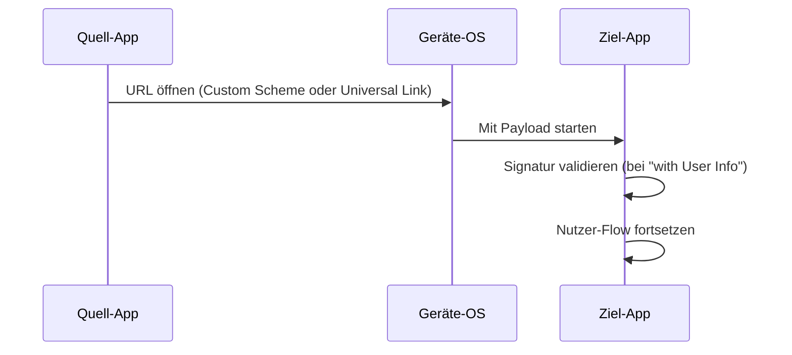

# App-to-App Services

> **Bewege einen Nutzer von einer App auf seinem Gerät in eine andere und nimm Kontext mit.** Entweder mit Identität (signiertes Payload) oder anonym (nur Deep Link).

## Wann nutzt du das

- Eine Drittanbieter-App bettet einen **"Mit KOBIL bezahlen"** oder **"In MyCity öffnen"**-Button ein.
- Ein Partner-Workflow endet in deiner App und geht in einer anderen weiter.
- Du willst den KOBIL Super-App-Container aus deiner App heraus starten und dabei eine Session-Referenz mitgeben.

## Mit User-Info vs. ohne

| Variante | Was übertragen wird | Wann nutzen |
|---|---|---|
| **App2App with User Info** *(Coming Soon)* | Signierte Identity-Claims + Payload | Empfangs-App muss **wissen wer** der Nutzer ist, mit Beweis |
| **App2App without User Info** | Opakes Payload (Deep-Link-Parameter) | Anonyme Übergabe — Empfangs-App kümmert sich selber um Auth |

## Wie es läuft

## Unterseiten

- **App2App with User Info** *(Coming Soon)* — signierte Übergabe, Identity-Claims reisen mit.
- **App2App without User Info** — anonyme Deep-Link-Übergabe.

:::info Diese Sektion braucht Detail
Den App2App-Seiten fehlen aktuell Endpoint-Specs und Signature-Formate. Wir koordinieren mit dem mIdentity-Team, um diese zu publizieren. Bis dahin: KOBIL Solutions Engineer für die SDK-Referenz kontaktieren.
:::

## Weiter

- [KOBIL Identity](../core-integrations/kobil-identity) — die OIDC-Primitive, auf denen App2App-with-User-Info aufbaut.
