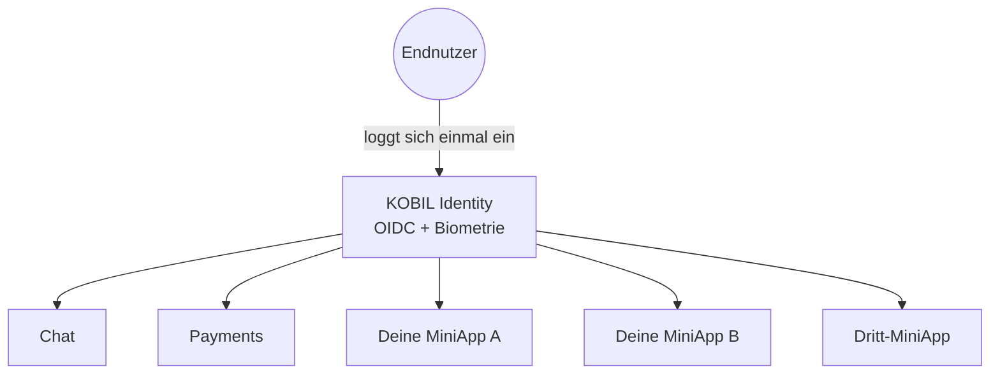

# Was ist eine Super App?

Eine **Super App** ist eine einzige mobile Anwendung, die viele unabhängige Services hostet — Payments, Chat, Behördenformulare, Loyalty-Karten, Mobility — hinter einem einzigen Login. Der Nutzer installiert den Container einmal; alles andere lebt darin.

## Was KOBIL liefert

KOBIL stellt das *Sicherheits- und Identitäts-Rückgrat* einer Super App:

- **Stark authentifizierte Identität** — biometrischer, gerätegebundener Login über die mIdentity-Companion-App.
- **Sicheres Messaging** — Server-zu-Nutzer-Chat mit Zustellungsgarantien und Antworten.
- **Transaktions-Signing** — Zahlungen und andere Aktionen werden vom Nutzer in mIdentity bestätigt, nicht nur im Browser geklickt.
- **MiniApp-Hosting** — eine Möglichkeit, deine bestehende Web/Native-UI in den Container einzubinden.

## Was du beisteuerst

- Deine **Geschäftslogik** — APIs, Datenbanken, Workflows.
- Deine **UI** — entweder als MiniApp im KOBIL-Container oder als separates Frontend, das KOBIL-Services aufruft.
- Dein **Branding** — KOBIL ist die Plattform. Endnutzer sehen *deine* Super App.

## Das "ein Nutzer, viele Services"-Bild

Eine einzige OIDC-Session schaltet jeden Service im Container frei. Genau das kaufen Partner ein — du musst Identity, Biometrie, Geräte-Bindung und Transaktions-Signing nicht selber bauen.

## Wann du *keine* Super App brauchst

Wenn du nur einen einzelnen Service einzeln brauchst (nur Login, nur Chat, nur Payments), kannst du den in deine bestehende App einbauen, ohne selber eine Super App zu werden. Die Patterns in [Core Integrations](../core-integrations/) funktionieren in beide Richtungen.

## Weiter

Mach mit dem [Glossar](./glossary) weiter, damit die Namen aufhören sich in deinem Kopf zu überlappen.
