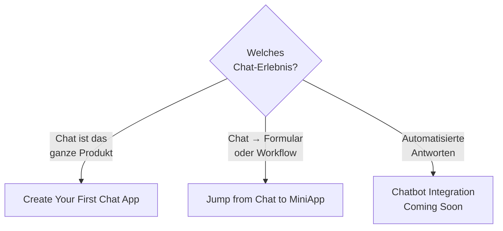

# Chat Services

> Rezepte für chat-getriebene UX, aufbauend auf [KOBIL Chat (mPower)](../core-integrations/kobil-chat). Wenn du nur eine einzelne Nachricht aus deinem Backend senden willst, reicht der Core-Service — diese Sektion deckt die Patterns ab, die darum herum laufen.

## Entscheidungsbaum

## Unterseiten

| Seite | Wann du sie brauchst |
|---|---|
| **Create Your First Chat App From Scratch** | Standalone-Chat-Produkt — keine anderen Services in der Super App |
| **Jump from Chat to MiniApp** | Eine Chat-Nachricht öffnet beim Tippen eine MiniApp (Formular, Zahlungsbestätigung, Dokumenten-Signing) |
| **Chatbot Integration** *(Coming Soon)* | Bot-Framework an die Chat-Surface anschließen |

## Voraussetzungen

Alle Chat-Services teilen sich denselben Setup:

- Server-zu-Server-OIDC-Client mit **Service Accounts ON** (siehe [Credentials anlegen](../before-you-start/get-credentials))
- Registrierte Webhook-URL — öffentlich, ohne Auth-Header
- Empfänger-Kennung = **E-Mail / Username**, nicht OIDC `sub` UUID

## Häufige Stolperfallen über alle Chat-Patterns

- Webhook wird aufgerufen, aber ignoriert → prüfen ob Webhook-Pfad **in `proxy.ts` / Auth-Middleware allowlistet** ist.
- Outbound-Nachricht geht in Serverless verloren → `import { after } from "next/server"` nutzen, damit die Function nicht vor dem Upstream-Call returnt. Siehe [Production-Checkliste](../reference/production-checklist).

## Weiter

- [KOBIL Chat (mPower)](../core-integrations/kobil-chat) — die zugrundeliegende API.
- [Architektur-Diagramme](../reference/architecture-diagrams) — Sequenzdiagramme für Chat + Webhook.
