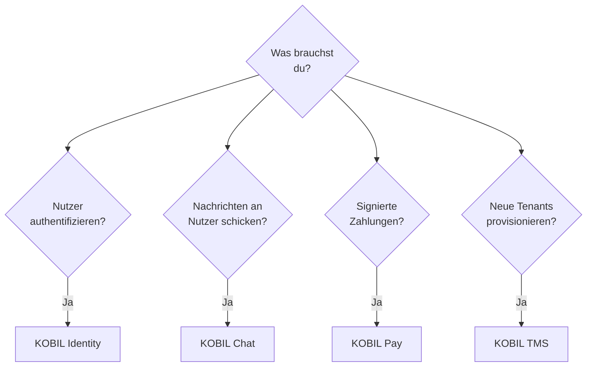

# Core Integrations

Die vier KOBIL-Services, auf denen jede Super App aufbaut.

## Entscheidungsbaum — was brauchst du?

Die meisten Super Apps brauchen **Identity + Chat + Pay**. TMS wird hauptsächlich vom KOBIL-Operations-Team und von Partnern genutzt, die an mehrere Sub-Tenants weiterverkaufen.

## Die vier Services

| Service | Wofür | Auth | Host |
|---|---|---|---|
| [**KOBIL Identity**](./kobil-identity) | OIDC-Login mit mIdentity-gebundenen Nutzern | OIDC-Discovery | `idp.<tenant>.kobil.com` |
| [**KOBIL Chat**](./kobil-chat) | Server → Nutzer-Messaging via mPower, mit Reply-Webhook | `client_credentials` | `idp.<tenant>.kobil.com` |
| [**KOBIL Pay**](./kobil-pay) | Merchant-Transaktionen, vom Nutzer in mIdentity signiert | `client_credentials` | `pay.<tenant>.kobil.com` |
| [**KOBIL TMS**](./kobil-tms) | Tenant- + Realm-Provisionierung | TMS-API-Key | (variiert — Solutions Engineering fragen) |

Alle vier teilen sich das **Multi-Client-OIDC-Pattern** (ein User-facing Authorization Code + PKCE-Client, ein Server-zu-Server `client_credentials`-Client). Siehe [Credentials anlegen](../before-you-start/get-credentials), falls noch nicht geschehen.
