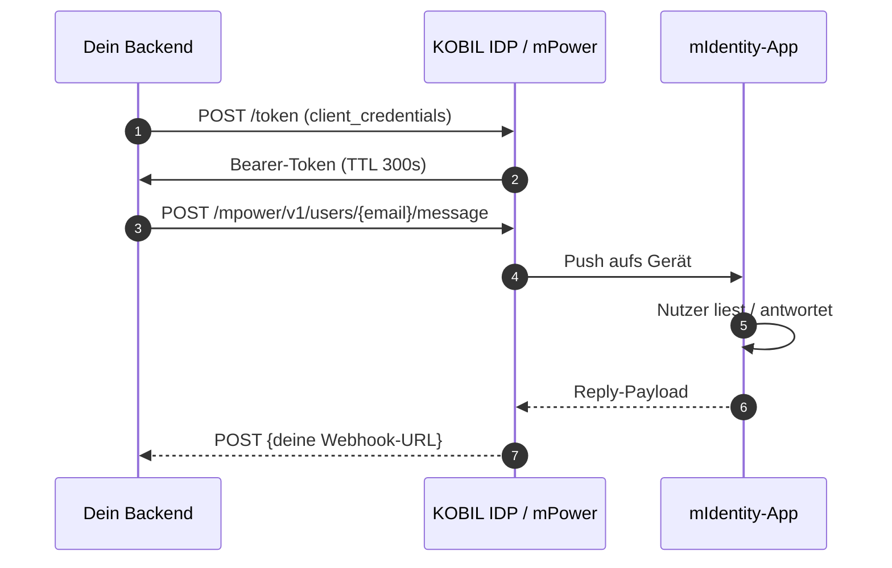

# KOBIL Chat (mPower)

> **Server-seitige Messaging-API.** Dein Backend postet eine Nachricht; KOBIL stellt sie auf das mIdentity-gebundene Gerät des Nutzers zu. Antworten kommen auf deinem registrierten Webhook an.

## Wann nutzt du das

- Server → Nutzer-Notifications und Prompts (Buchungsbestätigungen, Action-Requests, Auswahlen).
- Zwei-Wege-Chat zwischen Sachbearbeitung und Nutzern.
- Überall wo du sonst SMS nehmen würdest — aber mit kryptografischem Zustellungsbeweis und ohne Telco-Kosten.

## Hosts und Pfade

Die KOBIL-Chat-REST-Surface heißt **mPower** und läuft auf dem **IDP-Host** (nicht auf einem separaten `mercury.*`-Host, wie ältere Doku andeutet):

```
POST {idp_host}/auth/realms/{realm}/mpower/v1/users/{userId}/message
```

- `{idp_host}` = `https://idp.<tenant>.kobil.com` (z. B. `https://idp.mycity.kobil.com`)
- `{realm}` = Keycloak-Realm (z. B. `buergerapp`)
- `{userId}` = **E-Mail / Username** des Empfängers — NICHT die OIDC `sub` UUID

:::warning Legacy-Host
Ältere Doku referenziert `mercury.<tenant>.kobil.com`. Für aktuelle Cloud-Tenants auf `idp.*` umschalten, wenn 404 / HTML-Antworten kommen.
:::

## Wie es funktioniert



## Authentifizierung

Standard `client_credentials` aus demselben Realm. Der Chat-App-OIDC-Client muss **Service Accounts Enabled = ON** haben.

```bash
curl -X POST {idp_host}/auth/realms/{realm}/protocol/openid-connect/token \
  -u 'your-app-server:<secret>' \
  -d 'grant_type=client_credentials'
```

Token cachen (~270 s). Bei 401 invalidieren und einmal neu versuchen.

## Request-Body-Schema

```json
{
  "serviceUuid": "<chat-app client_id>",
  "version": 3,
  "messageType": "processChatMessage",
  "messageContent": {
    "messageText": "Dein Termin ist bestätigt.",
    "choices": [{ "text": "Danke" }, { "text": "Stornieren" }]
  }
}
```

| Feld | Pflicht | Hinweise |
|---|---|---|
| `serviceUuid` | ja | Muss der `client_id` des Access-Tokens entsprechen. Mismatch → 401/403. |
| `version` | ja | Aktuell `3`. |
| `messageType` | ja | Eines von: `processChatMessage`, `choiceRequest`, `smartScreenService`, `attachmentMessage`. **`plainText` wird abgelehnt.** |
| `messageContent.messageText` | ja | Sichtbarer Nachrichtentext. |
| `messageContent.choices` | nein | Für `choiceRequest`-artige Flows. |

## Vollständiges Request-Beispiel

```bash
TOKEN=$(curl -s -X POST {idp_host}/auth/realms/{realm}/protocol/openid-connect/token \
  -u 'your-app-server:<secret>' \
  -d 'grant_type=client_credentials' | jq -r .access_token)

curl -X POST "{idp_host}/auth/realms/{realm}/mpower/v1/users/alice@example.com/message" \
  -H "Authorization: Bearer $TOKEN" \
  -H "Content-Type: application/json" \
  -d '{
    "serviceUuid": "your-app-server",
    "version": 3,
    "messageType": "processChatMessage",
    "messageContent": { "messageText": "Hallo Alice!" }
  }'
```

Erwartet: HTTP 200, leerer Body oder kleines Ack-JSON. Der Nutzer bekommt kurz darauf einen Push auf seinem mIdentity-Gerät.

## Inbound-Webhook-Payload

Wenn der Nutzer antwortet (oder eine Choice anklickt), POSTet KOBIL auf deine registrierte Webhook-URL:

```json
{
  "message": {
    "category": "chat",
    "content": {
      "messageContent": { "messageText": "..." },
      "messageType": "init",
      "version": 3
    },
    "from": { "userId": "alice@example.com", "ecoId": "<realm>" },
    "serviceUuid": "<chat-app client_id>",
    "timestamp": "...",
    "messageId": "...",
    "responseId": "...",
    "instanceId": "..."
  }
}
```

`messageType` für Inbound-Nachrichten: eines von `init`, `choiceResponse`, `processChatMessage`.

:::warning Webhook-Auth
Der Webhook muss **öffentlich erreichbar sein, ohne Auth-Header**. Pfad in `proxy.ts` / Middleware allowlisten. Die KOBIL-Pay-Doku sagt explizit dasselbe für ihren merchantCallback.
:::

## Häufige Fehler

| Status | Symptom | Ursache | Fix |
|---|---|---|---|
| 404 | *User does not exist* | OIDC `sub` UUID statt E-Mail gesendet | E-Mail / Username im Pfad verwenden |
| 403 | HTML-Body | Falscher Host (`pay.*` für Chat oder umgekehrt) | `idp.*` für Chat |
| 401 | Nach Idle | Token-Cache veraltet | Invalidieren, einmal neu versuchen |
| 401 | Sofort | `serviceUuid` ≠ Token-`client_id` | `serviceUuid` auf gleiche `client_id` setzen |
| 400 | `messageType: "plainText"` abgelehnt | Falsches Type-Literal | `processChatMessage` verwenden |

## TypeScript-Helper

```ts
// lib/kobil-chat.ts
import { getServerToken } from "./kobil-token";

export async function sendChatMessage(recipientEmail: string, text: string) {
  const token = await getServerToken();
  const url = `${process.env.KOBIL_MPOWER_BASE}/users/${encodeURIComponent(recipientEmail)}/message`;

  const res = await fetch(url, {
    method: "POST",
    headers: {
      Authorization: `Bearer ${token}`,
      "Content-Type": "application/json",
    },
    body: JSON.stringify({
      serviceUuid: process.env.KOBIL_SERVER_CLIENT_ID,
      version: 3,
      messageType: "processChatMessage",
      messageContent: { messageText: text },
    }),
  });

  if (!res.ok) throw new Error(`Chat send failed: ${res.status} ${await res.text()}`);
}
```

## Referenz-Repo

[ipyoussef-rgb/terbuch](https://github.com/ipyoussef-rgb/terbuch) — siehe `lib/kobil-chat.ts` und `app/api/admin/chat-webhook/route.ts`.

## Weiter

- [KOBIL Pay](./kobil-pay) — gleiches Auth-Pattern, anderer Host und Surface.
- [Chat Services](../chat-services/) — Höher-Level-Patterns (Chat-only, Chat-zu-MiniApp).

---

*Zuletzt verifiziert: 2026-05-08 gegen Tenant `mycity.kobil.com`.*
