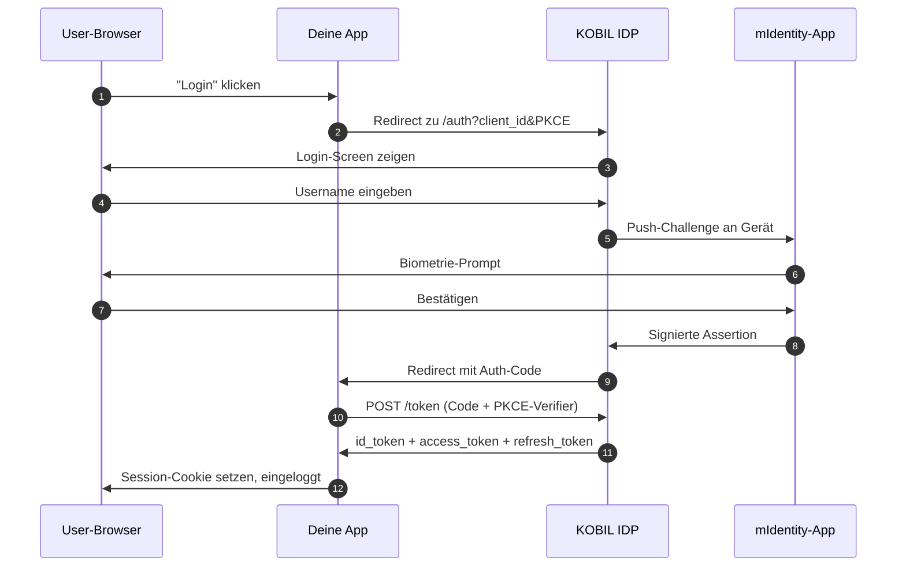

# KOBIL Identity

> **OIDC-Login auf Keycloak-Basis, mit dem zweiten Faktor in der mIdentity-App auf dem Gerät.** Das ist der Einstiegspunkt für jeden Super-App-Nutzer.

## Wann nutzt du das

- Jeder User-facing Flow in deiner Super App. Identity ist nicht optional.
- Standalone, wenn du nur Login brauchst (kein Chat, kein Pay) — dasselbe OIDC-Pattern funktioniert.

## Wie es funktioniert



## Endpoints

KOBIL Identity ist ein Keycloak-Realm. Standard-Discovery gilt:

```
{idp_host}/auth/realms/{realm}/.well-known/openid-configuration
{idp_host}/auth/realms/{realm}/protocol/openid-connect/auth
{idp_host}/auth/realms/{realm}/protocol/openid-connect/token
{idp_host}/auth/realms/{realm}/protocol/openid-connect/userinfo
{idp_host}/auth/realms/{realm}/protocol/openid-connect/logout
```

`{idp_host}` = `https://idp.<tenant>.kobil.com`, `{realm}` = Keycloak-Realm-Name. Manche Tenants nutzen den zentralen `https://idp.cloud.kobil.com`.

## Multi-Client-Pattern

Drei OIDC-Clients im selben Realm — Minimum zwei:

| Client | Auth-Flow | Settings |
|---|---|---|
| User UI | Authorization Code + PKCE (S256) | Standard Flow ON, Service Accounts OFF, Redirect URIs gesetzt |
| Admin UI (optional) | Authorization Code + PKCE (S256) | wie User UI, andere Redirect-URI |
| Server-zu-Server | `client_credentials` | Service Accounts ON, Standard Flow OFF |

Gleicher `idp_issuer` und `realm` für alle. Unterschiedliche `client_id` / `client_secret` pro Client.

Click-für-Click-Setup in [Credentials anlegen](../before-you-start/get-credentials).

## Service-zu-Service-Token

```bash
curl -X POST {idp_host}/auth/realms/{realm}/protocol/openid-connect/token \
  -u 'your-app-server:<server-client-secret>' \
  -d 'grant_type=client_credentials'
```

Antwort:

```json
{ "access_token": "eyJ...", "expires_in": 300, "token_type": "Bearer" }
```

**Token im Speicher cachen, ca. 270 s** (Keycloak-Default-TTL = 300 s). Bei 401 invalidieren und einmal mit frischem Token erneut versuchen.

## Claims-Mapping — die Flat-Attribute-Form

Standard-OIDC-Userinfo verschachtelt Adress-Claims unter `address.{...}`. **KOBIL-Tenants liefern sie häufig flach ODER unter `attributes.{key}[0]`** (Keycloak-Admin-Form):

```jsonc
// Flach
{ "phone": "00492555658", "street": "Pforten 11", "locality": "Worms", "postal_code": "67547", "bod": "1990-01-15" }

// Oder gewrapped
{ "attributes": { "phone": ["00492555658"], "street": ["Pforten 11"], "bod": ["1990-01-15"] } }
```

Defensiver Read-Helper, der beide Formen versteht:

```ts
function read(raw: Record<string, unknown>, ...names: string[]): string | undefined {
  const attrs = (raw.attributes ?? {}) as Record<string, unknown>;
  for (const name of names) {
    for (const v of [raw[name], attrs[name]]) {
      if (typeof v === "string" && v.length > 0) return v;
      if (Array.isArray(v) && typeof v[0] === "string" && v[0].length > 0) return v[0];
    }
  }
  return undefined;
}

const phone     = read(claims, "phone", "phone_number", "phoneNumber");
const birthdate = read(claims, "bod", "birthdate", "birthDate");
const street    = read(claims, "street", "street_address");
const postal    = read(claims, "postal_code", "postalCode");
const city      = read(claims, "locality", "city");
```

## Recipient-ID-Regel

Derselbe Nutzer hat **pro Downstream-Service eine andere Kennung**:

| Service | Kennung |
|---|---|
| Deine DB (kanonischer Schlüssel) | OIDC `sub` UUID |
| **mPower Chat** Pfad `/users/{userId}/message` | **E-Mail / Username** |
| **mPay** Body `userId` | **OIDC `sub` UUID** |

**Bei Login sowohl `sub` als auch `email` ablegen.** Wer das auslässt, sammelt downstream die häufigsten *"User does not exist"*-404er ein.

## Redirect-URIs

Keycloak validiert **Valid Redirect URIs exakt**. Häufige 400 *Invalid redirect_uri*-Ursachen:

- Trailing-Slash-Differenz (`/callback` vs. `/callback/`)
- Vercel-Preview-URL ≠ registrierte Prod-URL — `APP_BASE_URL` auf die kanonische Prod-URL setzen
- Fehlender `localhost`-Eintrag in Dev

Beide registrieren:

```
https://your.app/api/auth/{user|admin}/callback
http://localhost:3000/api/auth/{user|admin}/callback
```

## Häufige Fehler

| Symptom | Ursache | Fix |
|---|---|---|
| 400 *Invalid redirect_uri* | URL nicht exakt registriert | Genaue URL bei Valid Redirect URIs ergänzen |
| 500 mit `displayWide`-Macro-Error am Auth-Endpoint | Custom Login Theme defekt | Login Theme am Client auf leer setzen |
| 401 am Token-Endpoint | Falsche `client_id` / `client_secret` oder Realm | Im Credentials-Tab prüfen |
| `client_credentials` → 400 *unauthorized_client* | Service Accounts nicht aktiviert | Service Accounts ON |
| Userinfo zeigt Custom-Claims nicht | Mapper auf dem Client nicht gesetzt | Client Scopes → Mappers ergänzen |

## Referenz-Repo

Vollständige Implementierung in Next.js + `openid-client` v6: [ipyoussef-rgb/terbuch](https://github.com/ipyoussef-rgb/terbuch).

## Weiter

- [KOBIL Chat](./kobil-chat) — Server-zu-Nutzer-Messaging im selben Realm.
- [KOBIL Pay](./kobil-pay) — Merchant-Transaktionen im selben Realm.

---

*Zuletzt verifiziert: 2026-05-08.*
