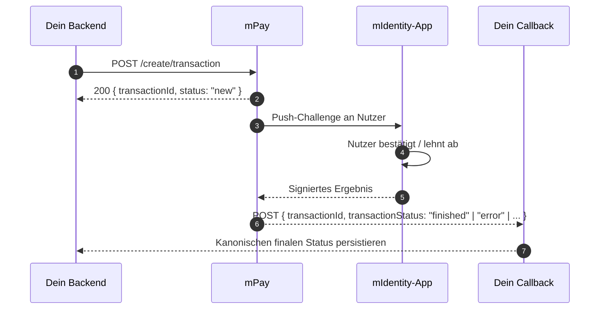

# KOBIL Pay (mPay)

> **Merchant-API für Transaktionen, vom Nutzer in seiner mIdentity-App signiert.** Strong Customer Authentication out-of-the-box; keine Karten-Netzwerk-Integration auf deiner Seite nötig.

## Wann nutzt du das

- Jede Zahlung, die starke Nutzer-Bestätigung braucht.
- Jeder "diese Aktion signieren"-Flow — Zahlungen sind die häufigste Anwendung, dieselbe Surface signiert aber auch andere Transaktionen.
- Wenn du einen Zustellungsbeweis willst, dass der *Nutzer* (nicht nur das Gerät) die Transaktion freigegeben hat.

## Hosts und Pfade

```
{pay_host}     = https://pay.<tenant>.kobil.com
{idp_host}     = https://idp.<tenant>.kobil.com    (nur für Token)
{realm}        = Keycloak-Realm-Name               (z. B. buergerapp)
```

| Operation | Methode | URL |
|---|---|---|
| Transaktion erstellen | POST | `{pay_host}/mpay-merchant/create/transaction` |
| Status-Abfrage (nur Ack) | POST | `{pay_host}/mpay-merchant/create/transaction/status` |
| Pre-Auth finalisieren | GET | `{pay_host}/mpay-merchant/create/transaction/postauth?id=...` |
| Stornieren (Void, vor EOD) | POST | `{pay_host}/mpay-merchant/create/transaction/void` |
| Erstattung (nach EOD, teilweise OK) | POST | `{pay_host}/mpay-merchant/create/transaction/refund` |

## Authentifizierung

Selbes `client_credentials`-Bearer-Token-Pattern wie [KOBIL Chat](./kobil-chat). Selber Realm. Selbe Token-Cache-Regeln.

## Wie eine Zahlung läuft



Die synchrone Antwort ist nur ein Ack. **Das echte Ergebnis kommt am `merchantCallback` an** — manchmal in Sekunden, manchmal in Minuten.

## Create-Transaction-Body

```json
{
  "version": 1,
  "idempotencyId": "<uuid>",
  "userId": "<KOBIL-User-UUID = OIDC sub>",
  "merchantId": "<Pay client_id>",
  "merchantServiceUUID": "<Pay client_id>",
  "merchantName": "Acme",
  "merchantCallback": "https://your.app/api/payment-callback",
  "transactionTimeout": 60,
  "amount": 296698,
  "tenantId": "<realm name>",
  "currency": "EUR",
  "paymentContent": [[{ "key": "Bearbeitungsgebühr", "value": "29.66 EUR" }]]
}
```

## Feldregeln, die beißen

| Feld | Regel | Warum es zählt |
|---|---|---|
| `userId` | **OIDC `sub` UUID** | Anders als Chat (das E-Mail nimmt). E-Mail hier → Fehler. |
| `amount` | **Kleinste Währungseinheit (Cent)** | `1999` = 19,99 €. |
| `transactionTimeout` | **Max 60 Sekunden** | `>60` → 400 `["transactionTimeout should be maximum 60"]`. |
| `merchantId` / `merchantServiceUUID` | Beide = **Pay-`client_id`** | Mismatch → 401/403. |
| `merchantCallback` | **Absolute URL, öffentlich, KEIN Auth** | KOBIL-Doku sagt explizit *"Shouldn't ask for Authorization."* |
| `idempotencyId` | UUID pro Versuch | Re-Tries mit gleicher ID buchen nicht doppelt. |
| `paymentContent` | Array von Arrays von `{key, value}` | Außen = Items; innen = Anzeige-Zeilen. |

## merchantCallback ist die Source of Truth

> Aus der Doku: *"all results of these operations will be delivered to you via your merchantCallback API address. We notify you of all changes of transaction status via API call."*

Der `/status`-Endpoint liefert nur ein Ack:

```json
{ "transactionId": "...", "status": "inquiring status", "message": "Inquire status in progress" }
```

Das echte Ergebnis kommt am `merchantCallback` an:

```json
{
  "transactionId": "...",
  "operationId": null,
  "status": "finished",
  "message": "Payment complete.",
  "transactionStatus": "finished",
  "transactionMessage": "Payment complete.",
  "cardGatewayType": null,
  "nextAction": null,
  "gateway": null
}
```

`transactionStatus` (oder `status`) ist der kanonische finale Wert.

## Die zwölf Status-Werte

| Roh | Final? | Normalisieren auf | Label |
|---|---|---|---|
| `new` | nein | `INITIATED` | Gestartet |
| `processing` | nein | `PENDING` | In Bearbeitung |
| `processing_3d_secure` | nein | `PENDING` | In Bearbeitung |
| `processing_digital` | nein | `PENDING` | In Bearbeitung |
| `notification` | nein | `PENDING` | In Bearbeitung |
| `inquiring status` (nur Ack) | nein | `PENDING` | Status-Abfrage läuft |
| `finished` | **ja** | `SUCCESS` | Bezahlt |
| `cancelled` | **ja** | `CANCELLED` | Storniert |
| `closed` | **ja** | `CANCELLED` | Storniert |
| `timeout` | **ja** | `TIMEOUT` | Abgelaufen |
| `error` | **ja** | `FAILED` | Fehlgeschlagen |
| `void` | **ja** | `REFUNDED` | Rückerstattet |
| `refund` | **ja** | `REFUNDED` | Rückerstattet |

## Status-Persistenz-Regel

:::danger Niemals einen finalen Status überschreiben
**Sobald `finished`, `cancelled`, `closed`, `timeout`, `error`, `void` oder `refund` persistiert ist, darf kein späterer `/status`-Poll diesen mit `inquiring status` oder einem anderen Nicht-Final-Wert überschreiben.**

Der `/status`-Endpoint kann `"inquiring status"` zurückliefern, *nachdem* der merchantCallback bereits SUCCESS geliefert hat. Naive Persistenz des Acks setzt deinen Datensatz von SUCCESS zurück auf PENDING / UNKNOWN. Der merchantCallback ist die Source of Truth.
:::

Implementierungs-Pattern:

```ts
const FINAL_STATUSES = new Set([
  "finished", "cancelled", "closed", "timeout", "error", "void", "refund",
]);

async function persistTransactionStatus(id: string, newStatus: string) {
  const current = await db.transactions.findUnique({ where: { id } });
  if (current && FINAL_STATUSES.has(current.status)) {
    return;
  }
  await db.transactions.update({ where: { id }, data: { status: newStatus } });
}
```

## Häufige Fehler

| Symptom | Ursache | Fix |
|---|---|---|
| 400 `transactionTimeout should be maximum 60` | `>60` gesendet | Auf 60 deckeln |
| Pay-Callback erhält 401 von deiner App | Auth-Middleware fängt ab | Callback-Pfad in `proxy.ts` allowlisten |
| Status bleibt für immer PENDING | Callback-URL relativ oder unerreichbar | Absolute URL via `APP_BASE_URL` |
| Status mit UNKNOWN / `inquiring status` überschrieben | Naive Persistenz des `/status`-Acks | Persistenz-Regel oben anwenden |
| 401 *Unauthorized* beim Create | Falsche `merchantId` / falscher Realm | `merchantId` = Pay-`client_id`, `tenantId` = Realm prüfen |
| 404 *user not found* | Falsche `userId` (E-Mail statt sub) | OIDC `sub` UUID nutzen |

## TypeScript-Helper

```ts
// lib/kobil-pay.ts
import { randomUUID } from "node:crypto";
import { getServerToken } from "./kobil-token";

interface CreatePaymentInput {
  userSub: string;
  amountCents: number;
  description: string;
  callbackUrl: string;
}

export async function createPayment(input: CreatePaymentInput) {
  const token = await getServerToken();
  const url = `${process.env.KOBIL_PAY_BASE}/mpay-merchant/create/transaction`;

  const res = await fetch(url, {
    method: "POST",
    headers: {
      Authorization: `Bearer ${token}`,
      "Content-Type": "application/json",
    },
    body: JSON.stringify({
      version: 1,
      idempotencyId: randomUUID(),
      userId: input.userSub,
      merchantId: process.env.KOBIL_SERVER_CLIENT_ID,
      merchantServiceUUID: process.env.KOBIL_SERVER_CLIENT_ID,
      merchantName: "My Super App",
      merchantCallback: input.callbackUrl,
      transactionTimeout: 60,
      amount: input.amountCents,
      tenantId: process.env.KOBIL_REALM,
      currency: "EUR",
      paymentContent: [[{ key: input.description, value: `${input.amountCents / 100} EUR` }]],
    }),
  });

  if (!res.ok) throw new Error(`Pay create failed: ${res.status} ${await res.text()}`);
  return res.json();
}
```

## Referenz-Repo

[ipyoussef-rgb/terbuch](https://github.com/ipyoussef-rgb/terbuch) — siehe `lib/kobil-pay.ts`, `app/api/payment-callback/route.ts` und `lib/payment-status.ts`.

## Weiter

- [Production-Checkliste](../reference/production-checklist) — was vor Go-Live verifiziert sein muss.
- [Fehlercodes & Troubleshooting](../reference/error-codes) — vollständige Liste über alle Services.

---

*Zuletzt verifiziert: 2026-05-08 gegen Tenant `mycity.kobil.com`.*
