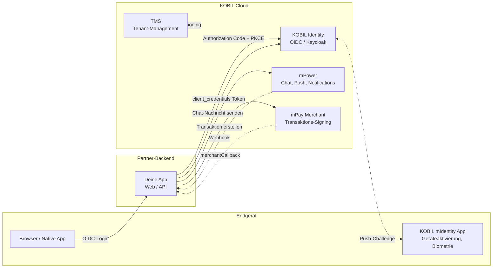

# Super App Services

> **Eine Super App ist ein mobiler Container, der unabhängige MiniApps, sicheren Chat, Payments und Identity hinter einem stark authentifizierten Nutzer vereint.**
> KOBIL liefert die Plattform; du bringst deine Services. Diese Doku führt dich als Partner-Entwickler von "noch keine Credentials" bis zur Produktivintegration.

:::info Für wen ist diese Doku?
Diese Dokumentation richtet sich an **Backend- und Full-Stack-Entwickler bei einem KOBIL-Partner**, die einen oder mehrere KOBIL-Services in ihre Anwendung integrieren. Wenn du KOBIL kommerziell evaluierst, starte stattdessen auf [kobil.com](https://kobil.com).
:::

## Architektur auf einen Blick

## Hier starten

Ein linearer Pfad von Null bis zur lauffähigen Integration. Schritte, die du schon erledigt hast, kannst du überspringen.

| # | Schritt | Zeit | Was du bekommst |
|---|---|---|---|
| 1 | [Bevor du startest](./before-you-start/) | 10 Min | Vokabular, Voraussetzungen und alle Credentials, die du von uns brauchst |
| 2 | [Quickstart: Hello SuperApp](./quickstart) | 60 Min | Lauffähige Next.js-App mit Login, einer Chat-Nachricht und einer Zahlung |
| 3 | [Wähle deine Services](#wähle-deine-services) | je nach Bedarf | Tiefer Einstieg in die Services, die du wirklich brauchst |
| 4 | [Production-Checkliste](./reference/production-checklist) | 30 Min | Härtung, Observability, Rate Limits, Callback-Sicherheit |

## Wähle deine Services

Sobald der Quickstart läuft, geh in die Tiefe der Services, die dein Produkt braucht.

### [Core Integrations](./core-integrations/)

Die vier Bausteine, aus denen jede Super App besteht.

- **[KOBIL Identity](./core-integrations/kobil-identity)** — OIDC-Login, Single Sign-On, Claims, Multi-Client-Pattern.
- **[KOBIL Chat](./core-integrations/kobil-chat)** — Server-zu-Nutzer-Messaging via mPower-API, mit Webhook für Antworten.
- **[KOBIL Pay](./core-integrations/kobil-pay)** — Merchant-Transaktionen über mPay, vom Nutzer in mIdentity signiert.
- **[KOBIL TMS](./core-integrations/kobil-tms)** — Tenant-Provisionierung und Realm-Management.

### [MiniApp Services](./miniapp-services/)

Bette deine eigene UI in den Super-App-Container ein — Manifest, Lifecycle, Distribution.

### [Chat Services](./chat-services/)

Höherwertige Chat-Patterns: reine Chat-App, Chat-zu-MiniApp-Sprünge, (bald) Chatbot-Integration.

### [App-to-App Services](./app-to-app/)

Übergib Kontext zwischen zwei Apps auf demselben Gerät — mit oder ohne Identifikation des Nutzers.

## Reference

- [Architektur-Diagramme](./reference/architecture-diagrams) — Copy-Paste-fertige Mermaid-Sequenzen für jeden Flow.
- [Fehlercodes & Troubleshooting](./reference/error-codes) — die 401/403/404, die du treffen wirst, und ihr Fix.
- [Production-Checkliste](./reference/production-checklist) — was vor Go-Live verifiziert sein muss.

---

*Zuletzt verifiziert: 2026-05-08 gegen Tenant `mycity.kobil.com`.*
