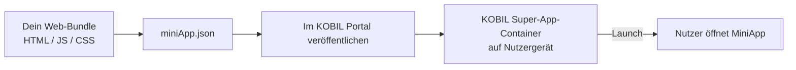

# MiniApp Services

> **Eine MiniApp ist deine Anwendung, die innerhalb des KOBIL Super-App-Containers läuft.** Der Nutzer hat den Container schon installiert und ist schon authentifiziert; deine MiniApp erbt beides.

## Wann eine MiniApp sinnvoll ist

- Du willst **über die KOBIL Super App distribuieren** — keine eigene App-Store-Präsenz nötig.
- Du willst **die Session des Nutzers erben** — kein zweiter Login.
- Du willst **starke Aktionen via mIdentity signieren** lassen, ohne das selber zu bauen.

## Wann *keine* MiniApp

- Du brauchst nur Server-Side-Integration (keine UI im KOBIL) — dann direkt [Core Integrations](../core-integrations/) aufrufen.
- Du brauchst Offline-First-Native-Capabilities, die die MiniApp-Surface nicht freigibt.

## Wie eine MiniApp ausgeliefert wird

## Unterseiten

- **Build Your First MiniApp** — Sample klonen, anpassen, lokal im Dev-Container laufen lassen.
- **Publish & Distribute** — Bundle hochladen, Manifest setzen, nach Staging und Produktion pushen.

:::info Diese Sektion braucht Detail
Die MiniApp-Unterseiten sind Stubs und warten auf Input vom MiniApp-Team. Das `miniApp.json`-Schema wird derzeit vom [miniApp.json-Generator](https://documentation.cloud.kobil.com/) erzeugt — die Feld-Referenz veröffentlichen wir hier.
:::

## Tooling

- [**miniApp.json-Generator**](https://documentation.cloud.kobil.com/) — interaktives Formular, das ein gültiges Manifest erzeugt.
- [**Sample MiniApps**](https://documentation.cloud.kobil.com/) — Referenzprojekte zum Forken.
- **KOBIL AI Assistant** — Chat-basierte Hilfe direkt in der Doku.

## Weiter

- [Core Integrations](../core-integrations/) — die Services, die deine MiniApp aufruft.
- [Chat Services](../chat-services/) — inklusive **Jump from Chat to MiniApp**, wo eine Chat-Nachricht beim Tippen eine MiniApp startet.
