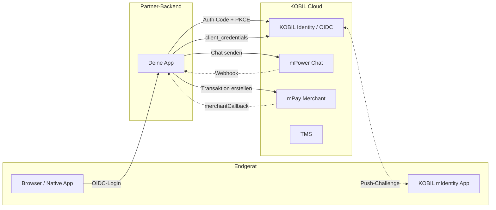
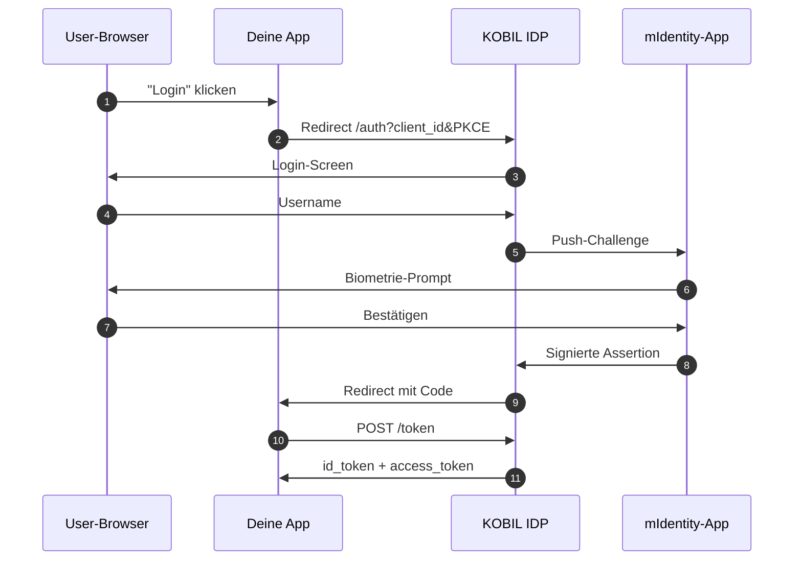
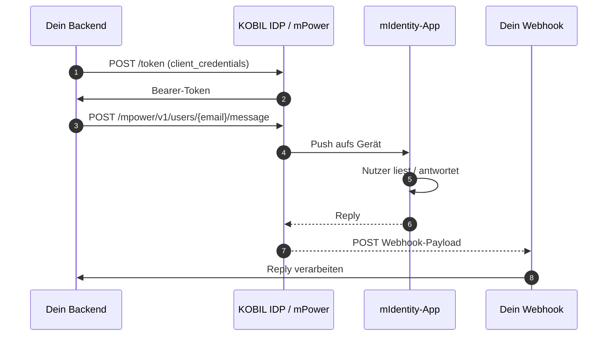
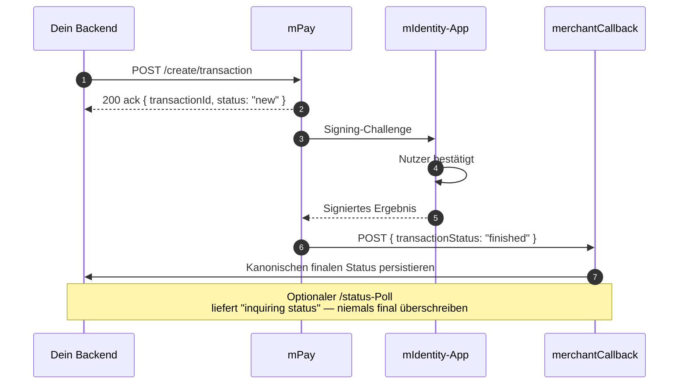
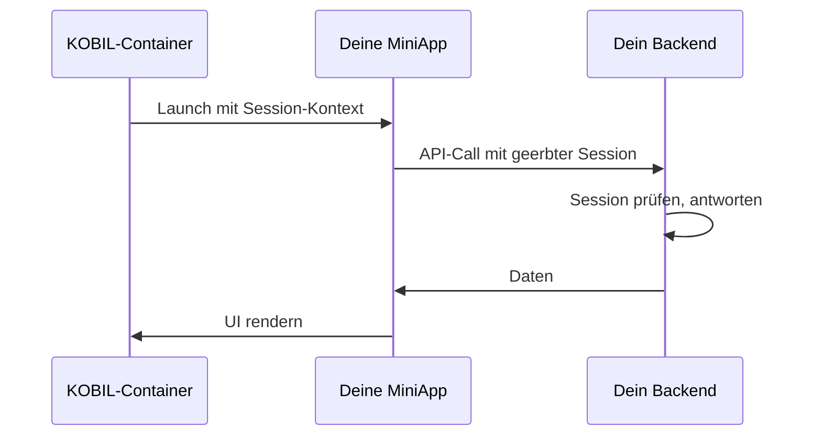

# Architektur-Diagramme

Alle Diagramme nutzen Mermaid und rendern nativ in Docusaurus. Kopier sie in deine eigenen Design-Docs.

## Plattform-Überblick

## OIDC-Login

## Chat: Senden + Antwort

## Pay: Erstellen + Signieren + Callback

## MiniApp-Launch

